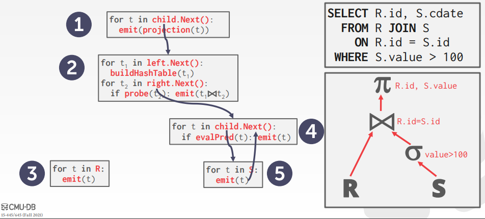
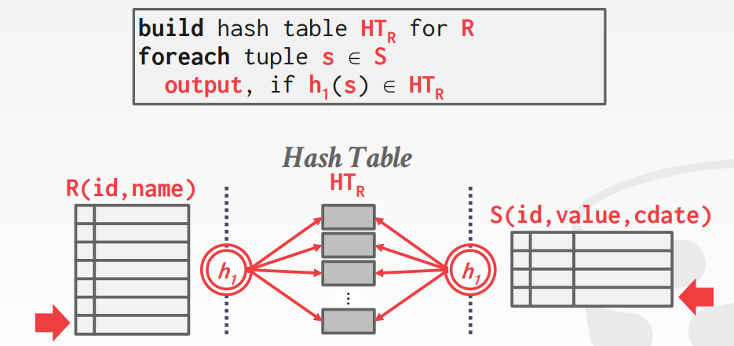
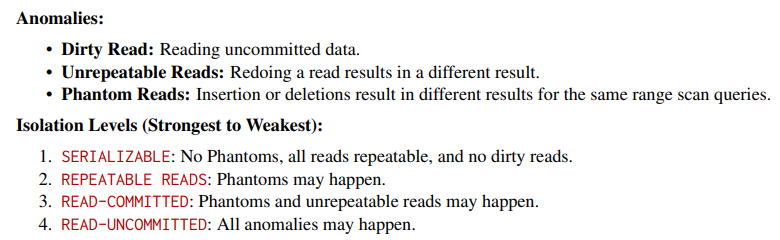
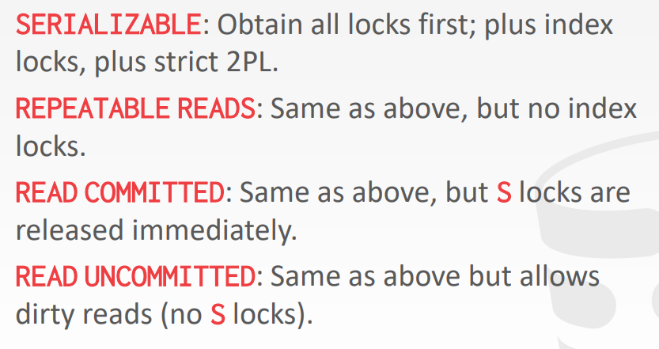
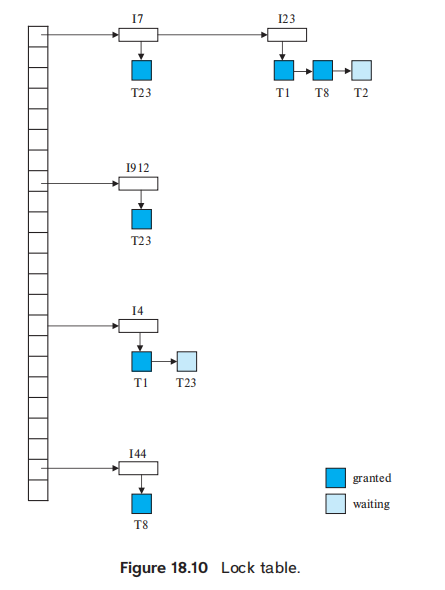

# 测试相关指令
由于 2021 版本测试网站已经关闭所以只能够通过目录进行测试
```shell
# 测试 starter
mkdir build
cd build
make starter_test
./test/starter_test
```

# 实验0
 在本实验中需要实现三个类，其中Matrix作为矩阵类型的基类，存放指向实际矩阵元素数组的指针；RowMatrix 为 Matrix 的子类，存放指向各矩阵行的指针，并提供按行列数访问矩阵元素的接口；RowMatrixOperations提供矩阵相加、相乘函数的接口。本实验的逻辑比较简单，主要考察对C++继承和模板的使用。

## c++ 知识
### 1. c++ 中给成员变量进行赋值的方法 直接给成员变量 rows_ 和 cols_ 进行赋值
```c++
Matrix(int rows, int cols) : rows_(rows), cols_(cols) { linear_ = new T[rows * cols + 1]; }
```
### 2. c++ 中的虚函数 和纯虚函数
```c++
public:
    /** @return The number of rows in the matrix */
    virtual int GetRowCount() const = 0;
```
这是一个纯虚函数的声明，它属于一个抽象基类。这个类可能用作矩阵类的接口。这个函数用来获取矩阵的行数。声明中的 = 0 表示这是一个纯虚函数，意味着任何继承自这个类的子类都必须实现这个函数，否则子类也将成为抽象类。

如果你不想把这个函数声明为纯虚函数，而是希望在基类中提供一个默认实现，你可以将 = 0 去掉，像这样：
```c++
public:
    /** @return The number of rows in the matrix */
    virtual int GetRowCount() const { return 0; }
```
这样，如果子类没有重写这个函数，就会使用基类中的默认实现，返回 0。

### 3. c++ 中的静态成员函数
静态成员函数是属于类而不是类的对象的函数。它们可以访问类的`静态成员和其他静态函数`，但不`能访问类的非静态成员`。静态成员函数使用类的名称而不是对象的名称来调用。

静态成员函数通常用于执行与类相关的操作，而不依赖于特定对象的状态。它们通常用于实现与类本身相关的功能，例如工厂函数或者用于执行一些全局操作的函数。
```c++
#include <iostream>

class MyClass {
public:
    static int staticData;
    static void staticMemberFunction() {
        std::cout << "Static member function\n";
    }
};

int MyClass::staticData = 0;
int main() {
    // 直接调用静态成员函数，无需创建对象
    MyClass::staticMemberFunction();
    // 访问静态成员变量
    std::cout << "Static data: " << MyClass::staticData << std::endl;

    return 0;
}
```
### 4. c++ 中的智能指针 unique_ptr
std::unique_ptr 是 C++11 标准中引入的智能指针，用于管理动态分配的资源。它提供了独占所有权的语义，即同一时间只能有一个 unique_ptr 指向特定的对象，当 unique_ptr 被销毁时，它所管理的对象也会被销毁。

下面是 std::unique_ptr 的基本用法：
```c++
#include <memory>

// 创建一个 unique_ptr 指向动态分配的对象
std::unique_ptr<int> ptr(new int);

// 访问指针指向的对象
*ptr = 42;

// 通过 release() 方法释放指针所有权，并返回指针的原始指针
int *rawPtr = ptr.release();

// 重新获取所有权
ptr.reset(rawPtr);

// 使用 reset() 方法释放当前指针，然后重新指向新的对象
ptr.reset(new int(100));

// 检查指针是否为空
if (ptr) {
    // 指针不为空，可以使用
}

// 使用 get() 方法获取指针的原始指针
int *rawPtr = ptr.get();
// unique_ptr 在作用域结束时会自动释放所管理的对象，不需要手动 delete
```

### 5. c++ 中的explicit 关键字
`explicit` 是 C++ 中的一个关键字，用于声明只能通过显式调用来创建对象的构造函数。在构造函数声明前加上 `explicit` 关键字可以防止编译器将该构造函数用于隐式类型转换。这样做可以增加代码的清晰度，并且可以防止一些意外的类型转换导致的错误。例如：

```cpp
class MyClass {
public:
    explicit MyClass(int x) : data(x) {}
    int GetData() { return data; }
private:
    int data;
};

int main() {
    // 显式调用构造函数
    MyClass obj1(10);
    
    // 隐式调用构造函数，会产生编译错误
    // MyClass obj2 = 10; // 编译错误
    
    return 0;
}
```
在上面的例子中，构造函数 `MyClass(int x)` 前面加上了 `explicit` 关键字，因此不能通过隐式类型转换来创建 `MyClass` 对象。

### 6. c++中的命名空间及其作用
在 C++ 中，命名空间（namespace）是用来组织代码并避免命名冲突的一种机制。通过将代码放置在命名空间中，可以将全局作用域划分为更小的区域，从而提高代码的可维护性和可读性。

命名空间的作用包括：
1. **避免命名冲突**：命名空间可以确保不同代码模块中的变量、函数和类名不会发生冲突，即使它们的名称相同也不会产生歧义。
2. **组织代码**：命名空间可以将相关联的变量、函数和类组织在一起，使代码结构更清晰。
3. **提高可读性**：通过使用命名空间，可以更清晰地了解代码的结构和关系，使代码更易于理解和维护。
下面是一个简单的示例，演示了如何使用命名空间：

```cpp
#include <iostream>

// 定义命名空间
namespace MyNamespace {
    int x = 10;

    void PrintX() {
        std::cout << "x = " << x << std::endl;
    }
}

int main() {
    // 访问命名空间中的变量和函数
    std::cout << "MyNamespace::x = " << MyNamespace::x << std::endl;
    MyNamespace::PrintX();
    
    return 0;
}
```

在这个例子中，`x` 和 `PrintX()` 函数被放置在 `MyNamespace` 命名空间中。通过使用 `MyNamespace::` 前缀，可以访问命名空间中的变量和函数。这样可以避免全局作用域中的命名冲突，并且使代码更具可读性和可维护性。

#### using 和 std
`using namespace std;` 是一个 C++ 中的命名空间引入语句，它允许你在代码中使用标准库 `std` 中的所有内容而无需显式地加上 `std::` 前缀。

例如：

```cpp
#include <iostream>

// 使用命名空间引入语句
using namespace std;

int main() {
    // 可以直接使用 cout，而不需要写成 std::cout
    cout << "Hello, world!" << endl;
    
    return 0;
}
```

尽管 `using namespace std;` 提供了方便，但有时也可能会引起命名冲突。因此，建议在大多数情况下，尽可能避免在头文件中使用 `using namespace std;`，而是在函数体内使用，或者使用 `using` 语句只引入需要的特定名称，例如：

```cpp
#include <iostream>

int main() {
    // 使用 using 语句引入需要的特定名称
    using std::cout;
    using std::endl;

    // 可以直接使用 cout 和 endl，而不需要写成 std::cout 和 std::endl
    cout << "Hello, world!" << endl;

    return 0;
}
```

这样可以减少潜在的命名冲突，并使代码更加清晰。
### 7. c++ 中的prev 关键字
在 C++ 中，`prev` 是 `<iterator>` 头文件中的一个函数模板，用于获取迭代器的前一个位置的迭代器。
```cpp
#include <iostream>
#include <vector>
#include <iterator> // 包含 prev 函数模板的头文件

int main() {
    std::vector<int> vec = {1, 2, 3, 4, 5};

    // 获取迭代器的前一个位置的迭代器
    auto it = std::prev(vec.end());

    // 输出前一个位置的值
    std::cout << "Previous element: " << *it << std::endl;

    return 0;
}
```
在这个示例中，`std::prev(vec.end())` 返回了指向 `vec` 中最后一个元素的前一个位置的迭代器，然后通过 `*it` 输出了前一个位置的值。

# Project 1 : BUFFER POOL  
## 测试指令和文件位置
You can also run `make check-tests` to run ALL of the test cases.
```shell
# 测试 lru
cd build
make lru_replacer_test
./test/lru_replacer_test


LRUReplacer: test/buffer/lru_replacer_test.cpp
BufferPoolManagerInstance: test/buffer/buffer_pool_manager_instance_test.cpp
ParallelBufferPoolManager: test/buffer/parallel_buffer_pool_manager_test.cpp
```

在本实验中，需要在存储管理器中实现缓冲池。缓冲池负责将物理页面从磁盘中读入内存、或从内存中写回磁盘，使得DBMS可以支持大于内存大小的存储容量。并且，缓冲池应当是用户透明且线程安全的。

## Task1 : LRU REPLACEMENT POLICY

 本部分中需要实现缓冲池中的`LRUReplacer`，该组件的功能是跟踪缓冲池内的页面使用情况，并在缓冲池容量不足时驱除缓冲池中最近最少使用的页面。其应当具备如下接口：

- `Victim(frame_id_t*)`：驱逐缓冲池中最近最少使用的页面，并将其内容存储在输入参数中。当`LRUReplacer`为空时返回False，否则返回True；
- `Pin(frame_id_t)`：当缓冲池中的页面被用户访问时，该方法被调用使得该页面从`LRUReplacer`中驱逐，以使得该页面固定在缓存池中；
- `Unpin(frame_id_t)`：当缓冲池的页面被所有用户使用完毕时，该方法被调用使得该页面被添加在`LRUReplacer`，使得该页面可以被缓冲池驱逐；
- `Size()`：返回`LRUReplacer`中页面的数目；

```c++
 28 class LRUReplacer : public Replacer {
 29  public:
 30   /**
 31    * Create a new LRUReplacer.
 32    * @param num_pages the maximum number of pages the LRUReplacer will be required to store
 33    */
 34   explicit LRUReplacer(size_t num_pages);
 35   
 36   /**
 37    * Destroys the LRUReplacer.
 38    */
 39   ~LRUReplacer() override;
 40   
 41   bool Victim(frame_id_t *frame_id) override;
 42 
 43   void Pin(frame_id_t frame_id) override;
 44   
 45   void Unpin(frame_id_t frame_id) override;
 46   
 47   size_t Size() override;
 48 
 49   void DeleteNode(LinkListNode *curr);
 50 
 51  private:
 52   // TODO(student): implement me!
 53   std::unordered_map<frame_id_t, std::list<frame_id_t>::iterator> data_idx_;
 54   std::list<frame_id_t> data_;
 55   std::mutex data_latch_;
 56 };
```

在这里，LRU策略可以由**哈希表加双向链表**的方式实现，其中链表充当队列的功能以记录页面被访问的先后顺序，哈希表则记录<页面ID - 链表节点>键值对，以在O(1)复杂度下删除链表元素。实际实现中使用STL中的哈希表`unordered_map`和双向链表`list`，并在`unordered_map`中存储指向链表节点的`list::iterator` 迭代器。

- `Victim(frame_id_t*)`：驱逐缓冲池中最近最少使用的页面，并将其容存内储在输入参数中。当`LRUReplacer`为空时返回False，否则返回True；
```C++
 21 bool LRUReplacer::Victim(frame_id_t *frame_id) {
 22   data_latch_.lock();
 23   if (data_idx_.empty()) {
 24     data_latch_.unlock();
 25     return false;
 26   }
 27   *frame_id = data_.front();
 28   data_.pop_front();
 29   data_idx_.erase(*frame_id);
 30   data_latch_.unlock();
 31   return true;
 32 }
```

对于`Victim`，首先判断链表是否为空，如不为空则返回链表首节点的页面ID，并在哈希表中解除指向首节点的映射。为了保证线程安全，整个函数应当由`mutex`互斥锁保护，下文中对互斥锁操作不再赘述。

- `Pin(frame_id_t)`：当缓冲池中的页面被用户访问时，该方法被调用使得该页面从`LRUReplacer`中删除，以使得该页面固定在缓存池中；
```C++
 34 void LRUReplacer::Pin(frame_id_t frame_id) {
 35   data_latch_.lock();
 36   auto it = data_idx_.find(frame_id);
 37   if (it != data_idx_.end()) {
 38     data_.erase(it->second);
 39     data_idx_.erase(it);
 40   }
 41   data_latch_.unlock();
 42 }
```

对于`Pin`，其检查`LRUReplace`中是否存在对应页面ID的节点，如不存在则直接返回，如存在对应节点则通过哈希表中存储的迭代器删除链表节点，并解除哈希表对应页面ID的映射。

- `Unpin(frame_id_t)`：当缓冲池的页面被所有用户使用完毕时，该方法被调用使得frame_id 对应的页面被添加在`LRUReplacer`，使得该页面可以被缓冲池驱逐；
```C++
 44 void LRUReplacer::Unpin(frame_id_t frame_id) {
 45   data_latch_.lock();
 46   auto it = data_idx_.find(frame_id);
 47   if (it == data_idx_.end()) {
 48     data_.push_back(frame_id);
 49     data_idx_[frame_id] = prev(data_.end());
 50   }
 51   data_latch_.unlock();
 52 }
```

对于`Unpin`，其检查`LRUReplace`中是否存在对应页面ID的节点，如存在则直接返回，如不存在则在链表尾部插入页面ID的节点，并在哈希表中插入<页面ID - 链表尾节点>映射。

```C++
 54 size_t LRUReplacer::Size() {
 55   data_latch_.lock();
 56   size_t ret = data_idx_.size();
 57   data_latch_.unlock();
 58   return ret;
 59 }
```
对于`Size`，返回哈希表大小即可。

## Task2 : BUFFER POOL MANAGER INSTANCE

在部分中，需要实现缓冲池管理模块，其从`DiskManager`中获取数据库页面，并在缓冲池强制要求时或驱逐页面时将数据库脏页面写回`DiskManager`。

```C++
 30 class BufferPoolManagerInstance : public BufferPoolManager {
...
134   Page *pages_;
135   /** Pointer to the disk manager. */
136   DiskManager *disk_manager_ __attribute__((__unused__));
137   /** Pointer to the log manager. */
138   LogManager *log_manager_ __attribute__((__unused__));
139   /** Page table for keeping track of buffer pool pages. */
140   std::unordered_map<page_id_t, frame_id_t> page_table_;
141   /** Replacer to find unpinned pages for replacement. */
142   Replacer *replacer_;
143   /** List of free pages. */
144   std::list<frame_id_t> free_list_;
145   /** This latch protects shared data structures. We recommend updating this comment to describe     what it protects. */
146   std::mutex latch_;
147 };

```

缓冲池的成员如上所示，其中`pages_`为缓冲池中的实际容器页面槽位数组，用于存放从磁盘中读入的页面，并供DBMS访问；`disk_manager_`为磁盘管理器，提供从磁盘读入页面及写入页面的接口；·`log_manager_`为日志管理器，本实验中不用考虑该组件；`page_table_`用于保存磁盘页面ID `page_id` 和槽位ID`frame_id_t`的映射；`raplacer_`用于选取所需驱逐的页面；`free_list_`保存缓冲池中的空闲槽位ID。在这里，区分`page_id`和`frame_id_t`是完成本实验的关键。

```C++
 28 class Page {
 29   // There is book-keeping information inside the page that should only be relevant to the buffer     pool manager.
 30   friend class BufferPoolManagerInstance;
 31 
 32  public:
 33   /** Constructor. Zeros out the page data. */
 34   Page() { ResetMemory(); }
 35 
 36   /** Default destructor. */
 37   ~Page() = default;
 38 
 39   /** @return the actual data contained within this page */
 40   inline auto GetData() -> char * { return data_; }
 41 
 42   /** @return the page id of this page */
 43   inline auto GetPageId() -> page_id_t { return page_id_; }
 44 
 45   /** @return the pin count of this page */
 46   inline auto GetPinCount() -> int { return pin_count_; }
 47 
 48   /** @return true if the page in memory has been modified from the page on disk, false otherwise     */
 49   inline auto IsDirty() -> bool { return is_dirty_; }
...
 77  private:
 78   /** Zeroes out the data that is held within the page. */
 79   inline void ResetMemory() { memset(data_, OFFSET_PAGE_START, PAGE_SIZE); }
 80 
 81   /** The actual data that is stored within a page. */
 82   char data_[PAGE_SIZE]{};
 83   /** The ID of this page. */
 84   page_id_t page_id_ = INVALID_PAGE_ID;
 85   /** The pin count of this page. */
 86   int pin_count_ = 0;
 87   /** True if the page is dirty, i.e. it is different from its corresponding page on disk. */
 88   bool is_dirty_ = false;
 89   /** Page latch. */
 90   ReaderWriterLatch rwlatch_;
 91 };

```

`Page`是缓冲池中的页面容器，`data_`保存对应磁盘页面的实际数据；`page_id_`保存该页面在磁盘管理器中的页面ID；`pin_count_`保存DBMS中正使用该页面的用户数目；`is_dirty_`保存该页面自磁盘读入或写回后是否被修改。下面，将介绍缓冲池中的接口实现：
*  `FlushPgImp`用于显式地将缓冲池页面写回磁盘
```C++
bool BufferPoolManagerInstance::FlushPgImp(page_id_t page_id) {
    // 确保调用了 DiskManager::WritePage 函数
    frame_id_t frame_id;
    latch_.lock(); // 锁住互斥量，防止多线程访问冲突
    if (page_table_.count(page_id) == 0U) {
        latch_.unlock(); // 如果页面不在缓冲池中，解锁并返回 false
        return false;
    }
    frame_id = page_table_[page_id]; // 获取页面对应的帧号
    pages_[frame_id].is_dirty_ = false; // 将页面标记为未被修改
    disk_manager_->WritePage(page_id, pages_[frame_id].GetData()); // 将页面数据写入磁盘
    latch_.unlock(); // 解锁互斥量
    return true;
}

```
`FlushPgImp`用于显式地将缓冲池页面写回磁盘。首先，应当检查缓冲池中是否存在对应页面ID的页面，如不存在则返回False；如存在对应页面，则将缓冲池内的该页面的`is_dirty_`置为false，并使用`WritePage`将该页面的实际数据`data_`写回磁盘。在这里，需要使用互斥锁保证线程安全，在下文中不再赘述。

*  `FlushAllPgsImp`将缓冲池内的所有页面写回磁盘。
```C++
 66 void BufferPoolManagerInstance::FlushAllPgsImp() {
 67   // You can do it!
 68   latch_.lock();
 69   for (auto [page_id, frame_id] : page_table_) {
 70     pages_[frame_id].is_dirty_ = false;
 71     disk_manager_->WritePage(page_id, pages_[frame_id].GetData());
 72   }
 73   latch_.unlock();
 74 }
```
在这里，遍历`page_table_`以获得缓冲池内的<页面ID - 槽位ID>对，通过槽位ID获取实际页面，并通过页面ID作为写回磁盘的参数。这里的 page_id 对应于磁盘上的 page的id。 frame_id 对应于内存中的 pages_数组的下标也可以理解是id。

* `NewPgImp`在磁盘中分配新的物理页面，将其添加至缓冲池，并返回指向缓冲池页面`Page`的指针。
```C++
 76 Page *BufferPoolManagerInstance::NewPgImp(page_id_t *page_id) {
 77   // 0.   Make sure you call AllocatePage!
 78   // 1.   If all the pages in the buffer pool are pinned, return nullptr.
 79   // 2.   Pick a victim page P from either the free list or the replacer. Always pick from the free list first.
 80   // 3.   Update P's metadata, zero out memory and add P to the page table.
 81   // 4.   Set the page ID output parameter. Return a pointer to P.
 82   frame_id_t new_frame_id;
 83   latch_.lock();
 84   if (!free_list_.empty()) {
 85     new_frame_id = free_list_.front();
 86     free_list_.pop_front();
 87   } else if (!replacer_->Victim(&new_frame_id)) {
 88     latch_.unlock();
 89     return nullptr;
 90   }
 91   *page_id = AllocatePage();
 92   if (pages_[new_frame_id].IsDirty()) {
 93     page_id_t flush_page_id = pages_[new_frame_id].page_id_;
 94     pages_[new_frame_id].is_dirty_ = false;
 95     disk_manager_->WritePage(flush_page_id, pages_[new_frame_id].GetData());
 96   }
 97   page_table_.erase(pages_[new_frame_id].page_id_);
 98   page_table_[*page_id] = new_frame_id;
 99   pages_[new_frame_id].page_id_ = *page_id;
100   pages_[new_frame_id].ResetMemory();
101   pages_[new_frame_id].pin_count_ = 1;
102   replacer_->Pin(new_frame_id);
103   latch_.unlock();
104   return &pages_[new_frame_id];
105 }
```

在这里，该函数由以下步骤组成：
1. 检查当前缓冲池中是否存在空闲槽位或存放页面可被驱逐的槽位（下文称其为目标槽位），在这里总是先通过检查`free_list_`以查询空闲槽位，如无空闲槽位则尝试从`replace_`中驱逐页面并返回被驱逐页面的槽位。如目标槽位，则返回空指针；如存在目标槽位，则调用`AllocatePage()`为新的物理页面分配`page_id`页面ID。
2. 值得注意的是，在这里需要检查目标槽位中的页面是否为脏页面，如是则需将其写回磁盘，并将其脏位设为false；
3. 从`page_table_`中删除目标槽位中的原页面ID的映射，并将新的<页面ID - 槽位ID>映射插入，然后更新槽位中页面的元数据。需要注意的是，在这里由于我们返回了指向该页面的指针，我们需要将该页面的用户数`pin_count_`置为1，并调用`replacer_`的`Pin`。

* `FetchPgImp`的功能是获取对应页面ID的页面，并返回指向该页面的指针
```C++
107 Page *BufferPoolManagerInstance::FetchPgImp(page_id_t page_id) {
108   // 1.     Search the page table for the requested page (P).
109   // 1.1    If P exists, pin it and return it immediately.
110   // 1.2    If P does not exist, find a replacement page (R) from either the free list or the replacer.
111   //        Note that pages are always found from the free list first.
112   // 2.     If R is dirty, write it back to the disk.
113   // 3.     Delete R from the page table and insert P.
114   // 4.     Update P's metadata, read in the page content from disk, and then return a pointer to P.
115   frame_id_t frame_id;
116   latch_.lock();
117   if (page_table_.count(page_id) != 0U) {
118     frame_id = page_table_[page_id];
119     pages_[frame_id].pin_count_++;
120     replacer_->Pin(frame_id);
121     latch_.unlock();
122     return &pages_[frame_id];
123   }
124 
125   if (!free_list_.empty()) {
126     frame_id = free_list_.front();
127     free_list_.pop_front();
128     page_table_[page_id] = frame_id;
129     disk_manager_->ReadPage(page_id, pages_[frame_id].data_);
130     pages_[frame_id].pin_count_ = 1;
131     pages_[frame_id].page_id_ = page_id;
132     replacer_->Pin(frame_id);
133     latch_.unlock();
134     return &pages_[frame_id];
135   }
136   if (!replacer_->Victim(&frame_id)) {
137     latch_.unlock();
138     return nullptr;
139   }
140   if (pages_[frame_id].IsDirty()) {
141     page_id_t flush_page_id = pages_[frame_id].page_id_;
142     pages_[frame_id].is_dirty_ = false;
143     disk_manager_->WritePage(flush_page_id, pages_[frame_id].GetData());
144   }
145   page_table_.erase(pages_[frame_id].page_id_);
146   page_table_[page_id] = frame_id;
147   pages_[frame_id].page_id_ = page_id;
148   disk_manager_->ReadPage(page_id, pages_[frame_id].data_);
149   pages_[frame_id].pin_count_ = 1;
150   replacer_->Pin(frame_id);
151   latch_.unlock();
152   return &pages_[frame_id];
153 }
```
其由以下步骤组成：
1. 首先，通过检查`page_table_`以检查缓冲池中是否已经缓冲该页面，如果已经缓冲该页面，则直接返回该页面，并将该页面的用户数`pin_count_`递增以及调用`replacer_`的`Pin`方法；
2. 如缓冲池中尚未缓冲该页面，则需寻找当前缓冲池中是否存在空闲槽位或存放页面可被驱逐的槽位（下文称其为目标槽位），该流程与`NewPgImp`中的对应流程相似，唯一不同的则是传入目标槽位的`page_id`为函数参数而非由`AllocatePage()`分配得到。

* `DeletePgImp`的功能为从缓冲池中删除对应页面ID的页面，并将其插入空闲链表`free_list_`
```C++
155 bool BufferPoolManagerInstance::DeletePgImp(page_id_t page_id) {
156   // 0.   Make sure you call DeallocatePage!
157   // 1.   Search the page table for the requested page (P).
158   // 1.   If P does not exist, return true.
159   // 2.   If P exists, but has a non-zero pin-count, return false. Someone is using the page.
160   // 3.   Otherwise, P can be deleted. Remove P from the page table, reset its metadata and return it to the free list.
161   DeallocatePage(page_id);
162   latch_.lock();
163   if (page_table_.count(page_id) == 0U) {
164     latch_.unlock();
165     return true;
166   }
167   frame_id_t frame_id;
168   frame_id = page_table_[page_id];
169   if (pages_[frame_id].pin_count_ != 0) {
170     latch_.unlock();
171     return false;
172   }
173   if (pages_[frame_id].IsDirty()) {
174     page_id_t flush_page_id = pages_[frame_id].page_id_;
175     pages_[frame_id].is_dirty_ = false;
176     disk_manager_->WritePage(flush_page_id, pages_[frame_id].GetData());
177   }
178   page_table_.erase(page_id);
179   pages_[frame_id].page_id_ = INVALID_PAGE_ID;
180   free_list_.push_back(frame_id);
181   latch_.unlock();
182   return true;
183 }
```

其由以下步骤组成：

1. 首先，检查该页面是否存在于缓冲区，如未存在则返回True。然后，检查该页面的用户数`pin_count_`是否为0，如非0则返回False。在这里，不难看出`DeletePgImp`的返回值代表的是该页面是否被用户使用，因此在该页面不在缓冲区时也返回True；
2. 检查该页面是否为脏，如是则将其写回并将脏位设置为False。然后，在`page_table_`中删除该页面的映射，并将该槽位中页面的`page_id`置为`INVALID_PAGE_ID`。最后，将槽位ID插入空闲链表即可。


```C++
185 bool BufferPoolManagerInstance::UnpinPgImp(page_id_t page_id, bool is_dirty) {
186   latch_.lock();
187   frame_id_t frame_id;
188   if (page_table_.count(page_id) != 0U) {
189     frame_id = page_table_[page_id];
190     pages_[frame_id].is_dirty_ |= is_dirty;
191     if (pages_[frame_id].pin_count_ <= 0) {
192       latch_.unlock();
193       return false;
194     }
195     // std::cout<<"Unpin : pin_count = "<<pages_[frame_id].pin_count_<<std::endl;
196     if (--pages_[frame_id].pin_count_ == 0) {
197       replacer_->Unpin(frame_id);
198     }
199   }
200   latch_.unlock();
201   return true;
202 }
```

`UnpinPgImp`的功能为提供用户向缓冲池通知页面使用完毕的接口，用户需声明使用完毕页面的页面ID以及使用过程中是否对该页面进行修改。其由以下步骤组成：

1. 首先，需检查该页面是否在缓冲池中，如未在缓冲池中则返回True。如果在，则先检查该页面的用户数是否大于0，如不存在用户则返回false；
2. 递减该页面的用户数`pin_count_`，如在递减后该值等于0，则调用`replacer_->Unpin`以表示该页面可以被驱逐。
## Task 3 : PARALLEL BUFFER POOL MANAGER
不难看出，上述缓冲池实现的问题在于锁的粒度过大，其在进行任何一项操作时都将整个缓冲池锁住，因此几乎不存在并行性。在这里，并行缓冲池的思想是分配多个独立的缓冲池，并将不同的页面ID映射至各自的缓冲池中，从而减少整体缓冲池的锁粒度，以增加并行性。

```C++
 25 class ParallelBufferPoolManager : public BufferPoolManager {
...
 93  private:
 94   std::vector<BufferPoolManager *> instances_;
 95   size_t start_idx_{0};
 96   size_t pool_size_;
 97   size_t num_instances_;
 98 };
```
并行缓冲池的成员如上，`instances_`用于存储多个独立的缓冲池，`pool_size_`记录各缓冲池的容量，`num_instances_`为独立缓冲池的个数，`start_idx`见下文介绍。

- 构造函数和析构函数
```C++
 18 ParallelBufferPoolManager::ParallelBufferPoolManager(size_t num_instances, size_t pool_size, Disk    Manager *disk_manager,
 19                                                      LogManager *log_manager)
 20     : pool_size_(pool_size), num_instances_(num_instances) {
 21   // Allocate and create individual BufferPoolManagerInstances
 22   for (size_t i = 0; i < num_instances; i++) {
 23     BufferPoolManager *tmp = new BufferPoolManagerInstance(pool_size, num_instances, i, disk_mana    ger, log_manager);
 24     instances_.push_back(tmp);
 25   }
 26 }
 27 
 28 // Update constructor to destruct all BufferPoolManagerInstances and deallocate any associated me    mory
 29 ParallelBufferPoolManager::~ParallelBufferPoolManager() {
 30   for (size_t i = 0; i < num_instances_; i++) {
 31     delete (instances_[i]);
 32   }
 33 }
```
在这里，各独立缓冲池在堆区中进行分配，构造函数和析构函数需要完成相应的分配和释放工作。

```C++
 35 size_t ParallelBufferPoolManager::GetPoolSize() {
 36   // Get size of all BufferPoolManagerInstances
 37   return num_instances_ * pool_size_;
 38 }
 39 
 40 BufferPoolManager *ParallelBufferPoolManager::GetBufferPoolManager(page_id_t page_id) {
 41   // Get BufferPoolManager responsible for handling given page id. You can use this method in you    r other methods.
 42   return instances_[page_id % num_instances_];
 43 }
```

需要注意的是，`GetPoolSize`应返回全部缓冲池的容量，即独立缓冲池个数乘以缓冲池容量。
`GetBufferPoolManager` 返回页面ID所对应的独立缓冲池指针，在这里，通过对页面ID取余的方式将页面ID映射至对应的缓冲池。

```C++
 45 Page *ParallelBufferPoolManager::FetchPgImp(page_id_t page_id) {
 46   // Fetch page for page_id from responsible BufferPoolManagerInstance
 47   BufferPoolManager *instance = GetBufferPoolManager(page_id);
 48   return instance->FetchPage(page_id);
 49 }
 50 
 51 bool ParallelBufferPoolManager::UnpinPgImp(page_id_t page_id, bool is_dirty) {
 52   // Unpin page_id from responsible BufferPoolManagerInstance
 53   BufferPoolManager *instance = GetBufferPoolManager(page_id);
 54   return instance->UnpinPage(page_id, is_dirty);
 55 }
 56 
 57 bool ParallelBufferPoolManager::FlushPgImp(page_id_t page_id) {
 58   // Flush page_id from responsible BufferPoolManagerInstance
 59   BufferPoolManager *instance = GetBufferPoolManager(page_id);
 60   return instance->FlushPage(page_id);
 61 }
...
 82 bool ParallelBufferPoolManager::DeletePgImp(page_id_t page_id) {
 83   // Delete page_id from responsible BufferPoolManagerInstance
 84   BufferPoolManager *instance = GetBufferPoolManager(page_id);
 85   return instance->DeletePage(page_id);
 86 }
 87 
 88 void ParallelBufferPoolManager::FlushAllPgsImp() {
 89   // flush all pages from all BufferPoolManagerInstances
 90   for (size_t i = 0; i < num_instances_; i++) {
 91     instances_[i]->FlushAllPages();
 92   }
 93 }
```

上述函数仅需调用对应独立缓冲池的方法即可。值得注意的是，由于在缓冲池中存放的为缓冲池实现类的基类指针，因此所调用函数的应为缓冲池实现类的基类对应的虚函数。并且，由于`ParallelBufferPoolManager`和`BufferPoolManagerInstance`为兄弟关系，因此`ParallelBufferPoolManager`不能直接调用`BufferPoolManagerInstance`对应的`Imp`函数，因此直接在`ParallelBufferPoolManager`中存放`BufferPoolManagerInstance`指针也是不可行的。

```C++
 63 Page *ParallelBufferPoolManager::NewPgImp(page_id_t *page_id) {
 64   // create new page. We will request page allocation in a round robin manner from the underlying
 65   // BufferPoolManagerInstances
 66   // 1.   From a starting index of the BPMIs, call NewPageImpl until either 1) success and return     2) looped around to
 67   // starting index and return nullptr
 68   // 2.   Bump the starting index (mod number of instances) to start search at a different BPMI each time this function
 69   // is called
 70   Page *ret;
 71   for (size_t i = 0; i < num_instances_; i++) {
 72     size_t idx = (start_idx_ + i) % num_instances_;
 73     if ((ret = instances_[idx]->NewPage(page_id)) != nullptr) {
 74       start_idx_ = (*page_id + 1) % num_instances_;
 75       return ret;
 76     }
 77   }
 78   start_idx_++;
 79   return nullptr;
 80 }
```
在这里，为了使得各独立缓冲池的负载均衡，采用轮转方法选取分配物理页面时使用的缓冲池，在这里具体的规则如下：
1. 从`start_idx_`开始遍历各独立缓冲池，如存在调用`NewPage`成功的页面，则返回该页面并将`start_idx`指向该页面的下一个页面；
2. 如全部缓冲池调用`NewPage`均失败，则返回空指针，并递增`start_idx`。

# Project 2 : EXTENDIBLE HASH INDEX

## 测试指令
```shell
make -j hash_table_test
./test/hash_table_test

make -j hash_table_test
./test/hash_table_test
```

在本实验中，需要实现一个**磁盘备份**的**可扩展哈希表**，用于DBMS中的索引检索。磁盘备份指该哈希表可写入至磁盘中，在系统重启时可以将其重新读取至内存中使用。可扩展哈希表是动态哈希表的一种类型，其特点为桶在充满或清空时可以桶为单位进行桶分裂或合并，尽在特定情况下进行哈希表全表的扩展和收缩，以减小扩展和收缩操作对全表的影响。

本文介绍了书中未讲解的**低位可拓展哈希表**的原理及其实现，且原理与实现之间设置了跳转以方便阅读。


## 可扩展哈希表实现原理


在进行实验之前，我们应当了解可扩展哈希表的具体实现原理。在这里，其最根本的思想在于通过改变哈希表用于映射至对应桶的哈希键位数来控制哈希表的总大小，该哈希键位数被称为全局深度。下面是全局深度的一个例子：


上图为通过哈希函数对字符串产生哈希键的一个示例。可见，当哈希键的位数为32位时，不同的哈希键有2^32个，这代表哈希表将拥有上述数目的目录项以将哈希键映射至相应的哈希桶，该数目显然过于庞大了。因此，我们可以仅关注哈希键的低几位（高几位亦可，但使用低位更易实现）以缩小哈希表目录项的个数。例如，当我们仅关注哈希键的后三位时，不同的哈希键为`...000`至`...111`共8个，因此我们仅需为哈希表保存8个目录项即可将各低位不同的哈希键映射至对应的哈希表。


除了用于控制哈希表大小的全局深度外，每个哈希表目录项均具有一个**局部深度**，其记录该目录项所对应的哈希桶所关注的哈希键位数。因此，局部深度**以桶为单位**划分的，某个目录项的局部深度即为该目录项所指的桶的局部深度。例如，如上图可示，当表的全局深度为3，第`001`个目录项的局部深度为2时，哈希键为`...01`的所有键均将被映射至该目录项所对应的哈希桶中，即`001`和`101`两个目录项。因此，当哈希表的全局深度为`i`，某目录项的局部深度为`j`时，指向该目录项所对应的哈希桶的目录项个数为`2^(i-j)`。

下面，我将使用一个例子来展示可扩展哈希表的桶分裂/合并，表扩展/收缩行为。在说明中，将使用`i`代表表的全局深度，`j`代表目录项的局部深度：


<a name="splitmethod1"></a>如上图所示，当哈希表刚被创建时，其全局深度为0，即哈希表仅有一个目录项，任何一个哈希键都将被映射到同一个哈希桶。当该哈希桶被充满时，需要进行桶的分裂，在这里，桶分裂的方式有两种，其对应于桶对应目录项的局部深度小于全局深度、桶对应目录项的局部深度等于全局深度两种情况。

当桶对应目录项的局部深度等于全局深度时，指向该桶的目录项仅有一条，因此需要进行表拓展。表拓展后，将表的全局深度加一，并将指向原被分裂桶和新桶的两个目录项置为当前的全局深度，并将原哈希桶的记录重新插入至新哈希桶或原哈希桶。对于其他目录项，表扩展后低`i-1`位相同的目录项指向同一桶页面，低第`i`位相反的两个页面互为**分裂映像**（实验中的自命名词汇）。

注意，可能分裂后的记录仍然均指向同一哈希桶，在这种情况下需要继续扩展哈希表，为了方便讲解，在本章节中不考虑这种特殊情况。因此，当上图中的哈希桶充满时，哈希表将更新至下图所示形式：


在这里，表的全局深度由0变为1、两个目录项的局部深度被置为当前全局深度1。下面，当`...0`目录项所对应的桶被充满时，由于全局深度和该目录项的局部深度仍然相同，因此仍需进行表扩展：


下面，当`...00`目录项所对应的桶充满时，由于全局深度和该目录项的局部深度仍然相同，因此仍需进行表扩展：


<a name="splitmethod2"></a>此时，当.`..001`目录项所对应的桶充满时，由于该目录项的局部深度`j`小于全局深度`i`，因此有`2^(i-j)`个目录项指向所需分裂的哈希桶，因此不必进行表的拓展，仅需将桶分裂，并将原哈希桶映射的目录项的一半指向原哈希桶，另一半指向新哈希桶，最后将指向原哈希桶和新哈希桶的所有目录项的局部深度加一即可。划分的规则为低`j+1`位相同的目录项在分裂后仍指向同一个桶，这种分裂规则保证了局部深度的语义，即分裂后桶关注哈希键的低`j+1`位。

另一个可能的问题是，如何找到与该目录项指向同一哈希桶的其他目录项。在这里，对于全局深度为`i`，局部深度为`j`的目录项，与其共同指向同一哈希桶的目录项（下面将其称为兄弟目录项）的低`j`位相同，且通过以下三个特性可以方便的遍历所有兄弟目录项：

- 兄弟目录项中的最顶端（位表示最小）目录项为低`j`位不变、其余位为0的目录项；
- 相邻两个目录项的哈希键相差`1<<j`；
- 兄弟目录项的总数为`1<<(i - j)`。

上述操作代码实现[见下文](#splitcode)，分裂后的哈希表如下所示：


<a name="mergemethod"></a>可以看出低`j+1 = 2`位相同的目录项在分裂后指向同一哈希桶，即以`...01`和`...11`为结尾的目录项分别指向两个不同的哈希桶。当一个目录项所指的哈希桶为空时，需要判断其是否可以与其**目标目录项**所指的哈希桶合并。一个目录项的目标目录项可由其低第`j`位反转得到，值得注意的是，由于目录项间的局部深度可能不同，因此目标目录项不一定是可逆的。例如，上图中`...010`目录项的目标目录项为`...000`，而`...000`的目标目录项却为`...100`。目录项及其目标目录项所指的两个哈希桶的合并的条件如下：（1）两哈希桶均为空桶；（2）目录项及其目标目录项的局部深度相同且不为0。此时，若`...001`和`...011`目录项所指的两个哈希桶均为空，则可以进行合并（代码实现见[下文](#mergecode)）：


合并后，需要将指向合并后哈希桶的所有目录项的局部深度减一。此时，若`...000`和`...100`所指的哈希桶均为空，则可以进行合并：


当哈希桶合并后使得所有目录项的局部深度均小于全局深度时，既可以进行哈希表的收缩。在这里可以体现低位可拓展哈希表，即收缩哈希表仅需将全局深度减一即可，而不需改变其余任何哈希表的元数据。下图展示了哈希表收缩后的形态：


## Task 1 : PAGE LAYOUTS

为了能在磁盘中写入和读取该哈希表，在这里需要`实现两个页面类存储哈希表的数据`，其使用上实验中的`Page`页面作为载体，以在磁盘中被写入和读取，具体的实现原理将在下文中介绍：

### HashTableDirectoryPage


```C++
 25 /**
 26  *
 27  * Directory Page for extendible hash table.
 28  *
 29  * Directory format (size in byte):
 30  * --------------------------------------------------------------------------------------------
 31  * | LSN (4) | PageId(4) | GlobalDepth(4) | LocalDepths(512) | BucketPageIds(2048) | Free(1524)
 32  * --------------------------------------------------------------------------------------------
 33  */
 34 class HashTableDirectoryPage {
 35  public:
 ...
189  private:
190   page_id_t page_id_; // 页面的页面ID
191   lsn_t lsn_; // 日志序列号
192   uint32_t global_depth_{0}; // 哈希表的全局深度
193   uint8_t local_depths_[DIRECTORY_ARRAY_SIZE]; //局部深度
194   page_id_t bucket_page_ids_[DIRECTORY_ARRAY_SIZE]; // 各目录项所指向的桶所在的 page ID
195 };
```

该页面类作为哈希表的目录页面，保存哈希表中使用的所有元数据，包括该页面的页面ID，日志序列号以及哈希表的全局深度、局部深度及各目录项所指向的桶的页面ID。在本实验中，`GetSplitImageIndex`和`GetLocalHighBit`两个与分裂映像相关的概念并未用到，个人认为此概念并不关键。下面将展示一些稍有难度的函数实现：

```C++
 29 uint32_t HashTableDirectoryPage::GetGlobalDepthMask() { return (1U << global_depth_) - 1; }
...
 47 bool HashTableDirectoryPage::CanShrink() {
 48   uint32_t bucket_num = 1 << global_depth_;
 49   for (uint32_t i = 0; i < bucket_num; i++) {
 50     if (local_depths_[i] == global_depth_) {
 51       return false;
 52     }
 53   }
 54   return true;
 55 }
```

`GetGlobalDepthMask`通过位运算返回用于计算全局深度低位的掩码；`CanShrink()`检查当前所有有效目录项的局部深度是否均小于全局深度，以判断是否可以进行表合并。

### HashTableBucketPage
该页面类用于存放哈希桶的键值与存储值对，以及桶的槽位状态数据。
```C++
 37 template <typename KeyType, typename ValueType, typename KeyComparator>
 38 class HashTableBucketPage {
 39  public:
...
141  private:
142   // For more on BUCKET_ARRAY_SIZE see storage/page/hash_table_page_defs.h
143   char occupied_[(BUCKET_ARRAY_SIZE - 1) / 8 + 1]; // 统计桶中的槽是否被使用过 一个字节可以显示8 bucket
144   // 0 if tombstone/brand new (never occupied), 1 otherwise.
145   char readable_[(BUCKET_ARRAY_SIZE - 1) / 8 + 1]; // 用于标记桶中的槽是否被占用
146   // Do not add any members below array_, as they will overlap.
147   MappingType array_[0]; // 用于存储实际的键值
```

`occupied_`数组用于统计桶中的槽是否被使用过，当一个槽被插入键值对时，其对应的位被置为1，事实上，`occupied_`完全可以被一个`size`参数替代，但由于测试用例中需要检测对应的`occupied`值，因此在这里仍保留该数组；`readable_`数组用于标记桶中的槽是否被占用，当被占用时该值被置为1，否则置为0；`array_`是C++中一种弹性数组的写法，在这里只需知道它用于存储实际的键值对即可。

在这里，使用`char`类型存放两个状态数据数组，在实际使用应当按位提取对应的状态位。下面是使用位运算的状态数组读取和设置函数：

```C++
 87 template <typename KeyType, typename ValueType, typename KeyComparator>
 88 void HASH_TABLE_BUCKET_TYPE::RemoveAt(uint32_t bucket_idx) {
 89   readable_[bucket_idx / 8] &= ~(1 << (7 - (bucket_idx % 8)));
 90 }
 91 
 92 template <typename KeyType, typename ValueType, typename KeyComparator>
 93 bool HASH_TABLE_BUCKET_TYPE::IsOccupied(uint32_t bucket_idx) const {
 94   return (occupied_[bucket_idx / 8] & (1 << (7 - (bucket_idx % 8)))) != 0;
 95 }
 96 
 97 template <typename KeyType, typename ValueType, typename KeyComparator>
 98 void HASH_TABLE_BUCKET_TYPE::SetOccupied(uint32_t bucket_idx) {
 99   occupied_[bucket_idx / 8] |= 1 << (7 - (bucket_idx % 8));
100 }
101 
102 template <typename KeyType, typename ValueType, typename KeyComparator>
103 bool HASH_TABLE_BUCKET_TYPE::IsReadable(uint32_t bucket_idx) const {
104   return (readable_[bucket_idx / 8] & (1 << (7 - (bucket_idx % 8)))) != 0;
105 }
106 
107 template <typename KeyType, typename ValueType, typename KeyComparator>
108 void HASH_TABLE_BUCKET_TYPE::SetReadable(uint32_t bucket_idx) {
109   readable_[bucket_idx / 8] |= 1 << (7 - (bucket_idx % 8));
110 }
```

对于对应索引的键值读取直接访问`arrat_`数组即可：

```C++
 77 template <typename KeyType, typename ValueType, typename KeyComparator>
 78 KeyType HASH_TABLE_BUCKET_TYPE::KeyAt(uint32_t bucket_idx) const {
 79   return array_[bucket_idx].first;
 80 }
 81 
 82 template <typename KeyType, typename ValueType, typename KeyComparator>
 83 ValueType HASH_TABLE_BUCKET_TYPE::ValueAt(uint32_t bucket_idx) const {
 84   return array_[bucket_idx].second;
 85 }
```

```C++
 22 template <typename KeyType, typename ValueType, typename KeyComparator>
 23 bool HASH_TABLE_BUCKET_TYPE::GetValue(KeyType key, KeyComparator cmp, std::vector<ValueType> *result) {
 24   bool ret = false;
 25   for (size_t bucket_idx = 0; bucket_idx < BUCKET_ARRAY_SIZE; bucket_idx++) {
 26     if (!IsOccupied(bucket_idx)) {
 27       break;
 28     }
 29     if (IsReadable(bucket_idx) && cmp(key, KeyAt(bucket_idx)) == 0) {
 30       result->push_back(array_[bucket_idx].second);
 31       ret = true;
 32     }
 33   }
 34   return ret;
 35 }

```

`GetValue`提取桶中键为`key`的所有值，实现方法为遍历所有`occupied_`为1的位，并将键匹配的值插入`result`数组即可，如至少找到了一个对应值，则返回真。在这里，可以看出

```C++
 37 template <typename KeyType, typename ValueType, typename KeyComparator>
 38 bool HASH_TABLE_BUCKET_TYPE::Insert(KeyType key, ValueType value, KeyComparator cmp) {
 39   size_t slot_idx = 0;
 40   bool slot_found = false;
 41   for (size_t bucket_idx = 0; bucket_idx < BUCKET_ARRAY_SIZE; bucket_idx++) {
 42     if (!slot_found && (!IsReadable(bucket_idx) || !IsOccupied(bucket_idx))) {
 43       slot_found = true;
 44       slot_idx = bucket_idx;
 45       // LOG_DEBUG("slot_idx = %ld", bucket_idx);
 46     }
 47     if (!IsOccupied(bucket_idx)) {
 48       break;
 49     }
 50     if (IsReadable(bucket_idx) && cmp(key, KeyAt(bucket_idx)) == 0 && value == ValueAt(bucket_idx    )) {
 51       return false;
 52     }
 53   }
 54   if (slot_found) {
 55     SetReadable(slot_idx);
 56     SetOccupied(slot_idx);
 57     array_[slot_idx] = MappingType(key, value);
 58     return true;
 59   }
 60   return false;
 61 }
```

`Insert`向桶插入键值对，其先检测该键值对是否已经被插入到桶中，如是则返回假；如未找到该键值对，则从小到大遍历所有`occupied_`为1的位，如出现`readable_`为1的位，则在`array_`中对应的数组中插入键值对。由于此种插入特性，因此`occupied_`为1的位是连续的，因此`occupied_`的功能与一个`size`参数是等价的。在这里仍然采用`occupied_`数组的原因可能是提供静态哈希表的实现兼容性（静态哈希表采用线性探测法解决散列冲突，因此必须使用`occupied_`数组）。

```C++
 63 template <typename KeyType, typename ValueType, typename KeyComparator>
 64 bool HASH_TABLE_BUCKET_TYPE::Remove(KeyType key, ValueType value, KeyComparator cmp) {
 65   for (size_t bucket_idx = 0; bucket_idx < BUCKET_ARRAY_SIZE; bucket_idx++) {
 66     if (!IsOccupied(bucket_idx)) {
 67       break;
 68     }
 69     if (IsReadable(bucket_idx) && cmp(key, KeyAt(bucket_idx)) == 0 && value == ValueAt(bucket_idx    )) {
 70       RemoveAt(bucket_idx);
 71       return true;
 72     }
 73   }
 74   return false;
 75 }
```

`Remove`从桶中删除对应的键值对，遍历桶所有位即可。

```C++
112 template <typename KeyType, typename ValueType, typename KeyComparator>
113 bool HASH_TABLE_BUCKET_TYPE::IsFull() {
114   return NumReadable() == BUCKET_ARRAY_SIZE;
115 }
116 
117 template <typename KeyType, typename ValueType, typename KeyComparator>
118 uint32_t HASH_TABLE_BUCKET_TYPE::NumReadable() {
119   uint32_t ret = 0;
120   for (size_t bucket_idx = 0; bucket_idx < BUCKET_ARRAY_SIZE; bucket_idx++) {
121     if (!IsOccupied(bucket_idx)) {
122       break;
123     }
124     if (IsReadable(bucket_idx)) {
125       ret++;
126     }
127   }
128   return ret;
129 } 
130     
131 template <typename KeyType, typename ValueType, typename KeyComparator>
132 bool HASH_TABLE_BUCKET_TYPE::IsEmpty() {
133   return NumReadable() == 0;
134 }
```

`NumReadable()`返回桶中的键值对个数，遍历即可。`IsFull()`和`IsEmpty()`直接复用`NumReadable()`实现。

### Page与上述两个页面类的转换

在本部分中，有难点且比较巧妙的地方在于理解上述两个页面类是如何与`Page`类型转换的。在这里，上述两个页面类并非未`Page`类的子类，在实际应用中通过`reinterpret_cast`将`Page`与两个页面类进行转换。在这里我们回顾一下`Page`的数据成员：

```C++
 77  private:
 78   /** Zeroes out the data that is held within the page. */
 79   inline void ResetMemory() { memset(data_, OFFSET_PAGE_START, PAGE_SIZE); }
 80 
 81   /** The actual data that is stored within a page. */
 82   char data_[PAGE_SIZE]{};
 83   /** The ID of this page. */
 84   page_id_t page_id_ = INVALID_PAGE_ID;
 85   /** The pin count of this page. */
 86   int pin_count_ = 0;
 87   /** True if the page is dirty, i.e. it is different from its corresponding page on disk. */
 88   bool is_dirty_ = false;
 89   /** Page latch. */
 90   ReaderWriterLatch rwlatch_;
 91 };
```

可以看出，`Page`中用于存放实际数据的`data_`数组位于数据成员的第一位，其在栈区固定分配一个页面的大小。因此，在`Page`与两个页面类强制转换时，通过两个页面类的指针的操作仅能影响到`data_`中的实际数据，而影响不到其它元数据。并且在内存管理器中始终是进行所占空间更大的通用页面`Page`的分配（实验中的`NewPage`），因此页面的容量总是足够的。

## Task 2,3 : HASH TABLE IMPLEMENTATION + CONCURRENCY CONTROL

在这两个部分中，我们需要实现一个线程安全的可扩展哈希表。在对可扩展哈希表的原理清楚后，将其实现并不困难，难点在于如何在降低锁粒度、提高并发性的情况下保证线程安全。下面是哈希表的具体实现：

在构造函数中，为哈希表分配一个目录页面和桶页面，并设置目录页面的`page_id`成员、将哈希表的首个目录项指向该桶。最后，不要忘记调用`UnpinPage`向缓冲池告知页面的使用完毕。
```C++
 24 template <typename KeyType, typename ValueType, typename KeyComparator>
 25 HASH_TABLE_TYPE::ExtendibleHashTable(const std::string &name, BufferPoolManager *buffer_pool_manager,
 26                                      const KeyComparator &comparator, HashFunction<KeyType> hash_fn)
 27     : buffer_pool_manager_(buffer_pool_manager), comparator_(comparator), hash_fn_(std::move(hash_fn)) {
 28   // LOG_DEBUG("BUCKET_ARRAY_SIZE = %ld", BUCKET_ARRAY_SIZE);
 29   HashTableDirectoryPage *dir_page =
 30       reinterpret_cast<HashTableDirectoryPage *>(buffer_pool_manager_->NewPage(&directory_page_id_));
 31   dir_page->SetPageId(directory_page_id_);
 32   page_id_t new_bucket_id;
 33   buffer_pool_manager_->NewPage(&new_bucket_id);
 34   dir_page->SetBucketPageId(0, new_bucket_id);
 35   assert(buffer_pool_manager_->UnpinPage(directory_page_id_, true, nullptr));
 36   assert(buffer_pool_manager_->UnpinPage(new_bucket_id, true, nullptr));
 37 }
```

在构造函数中，为哈希表分配一个目录页面和桶页面，并设置目录页面的`page_id`成员、将哈希表的首个目录项指向该桶。最后，不要忘记调用`UnpinPage`向缓冲池告知页面的使用完毕。

提取目录页面、桶页面以及目录页面中的目录项的功能函数。
```C++
 54 template <typename KeyType, typename ValueType, typename KeyComparator>
 55 uint32_t HASH_TABLE_TYPE::KeyToDirectoryIndex(KeyType key, HashTableDirectoryPage *dir_page) {
 56   uint32_t hashed_key = Hash(key);
 57   uint32_t mask = dir_page->GetGlobalDepthMask();
 58   return mask & hashed_key;
 59 }
 60 
 61 template <typename KeyType, typename ValueType, typename KeyComparator>
 62 page_id_t HASH_TABLE_TYPE::KeyToPageId(KeyType key, HashTableDirectoryPage *dir_page) {
 63   uint32_t idx = KeyToDirectoryIndex(key, dir_page);
 64   return dir_page->GetBucketPageId(idx);
 65 }
 66 
 67 template <typename KeyType, typename ValueType, typename KeyComparator>
 68 HashTableDirectoryPage *HASH_TABLE_TYPE::FetchDirectoryPage() {
 69   return reinterpret_cast<HashTableDirectoryPage *>(buffer_pool_manager_->FetchPage(directory_page_id_));
 70 }
 71 
 72 template <typename KeyType, typename ValueType, typename KeyComparator>
 73 HASH_TABLE_BUCKET_TYPE *HASH_TABLE_TYPE::FetchBucketPage(page_id_t bucket_page_id) {
 74   return reinterpret_cast<HASH_TABLE_BUCKET_TYPE *>(buffer_pool_manager_-   >FetchPage(bucket_page_id));
 75 }
 76 
```
上面是一些用于提取目录页面、桶页面以及目录页面中的目录项的功能函数。

- `GetValue`从哈希表中读取与键匹配的所有值结果，其通过哈希表的读锁保护目录页面，并使用桶的读锁保护桶页面。
```C++
 80 template <typename KeyType, typename ValueType, typename KeyComparator>
 81 bool HASH_TABLE_TYPE::GetValue(Transaction *transaction, const KeyType &key, std::vector<ValueType> *result) {
 82   HashTableDirectoryPage *dir_page = FetchDirectoryPage();
 83   table_latch_.RLock();
 84   page_id_t bucket_page_id = KeyToPageId(key, dir_page);
 85   HASH_TABLE_BUCKET_TYPE *bucket = FetchBucketPage(bucket_page_id);
 86   Page *p = reinterpret_cast<Page *>(bucket);
 87   p->RLatch();
 88   bool ret = bucket->GetValue(key, comparator_, result);
 89   p->RUnlatch();
 90   table_latch_.RUnlock();
 91   assert(buffer_pool_manager_->UnpinPage(directory_page_id_, false, nullptr));
 92   assert(buffer_pool_manager_->UnpinPage(bucket_page_id, false, nullptr));
 93 
 94   return ret;
 95 }
```

`GetValue`从哈希表中读取与键匹配的所有值结果，其通过哈希表的读锁保护目录页面，并使用桶的读锁保护桶页面。具体的操作步骤为先读取目录页面，再通过目录页面和哈希对应的桶页面，最后调用桶页面的`GetValue`获取值结果。在函数返回时注意要`UnpinPage`所获取的页面。加锁时应当保证锁的获取、释放全局顺序以避免死锁。


`Insert`向哈希表插入键值对，这可能会导致桶的分裂和表的扩张，因此需要保证目录页面的读线程安全，一种比较简单的保证线程安全的方法为：在操作目录页面前对目录页面加读锁。但这种加锁方式使得`Insert`函数阻塞了整个哈希表，这严重影响了哈希表的并发性。

可以注意到，表的扩张的发生频率并不高，对目录页面的操作属于读多写少的情况，因此可以使用乐观锁的方法优化并发性能，其在`Insert`被调用时仅保持读锁，只在需要桶分裂时重新获得读锁。

```C++
100 template <typename KeyType, typename ValueType, typename KeyComparator>
101 bool HASH_TABLE_TYPE::Insert(Transaction *transaction, const KeyType &key, const ValueType &value    ) {
102   HashTableDirectoryPage *dir_page = FetchDirectoryPage();
103   table_latch_.RLock();
104   page_id_t bucket_page_id = KeyToPageId(key, dir_page);
105   HASH_TABLE_BUCKET_TYPE *bucket = FetchBucketPage(bucket_page_id);
106   Page *p = reinterpret_cast<Page *>(bucket);
107   p->WLatch();
108   if (bucket->IsFull()) { // 满则释放锁，并调用`UnpinPage`释放页面,再调用`SplitInsert`实现桶分裂和插入
109     p->WUnlatch();
110     table_latch_.RUnlock();
111     assert(buffer_pool_manager_->UnpinPage(directory_page_id_, true, nullptr));
112     assert(buffer_pool_manager_->UnpinPage(bucket_page_id, true, nullptr));
113     return SplitInsert(transaction, key, value);
114   }
115   bool ret = bucket->Insert(key, value, comparator_);
116   p->WUnlatch();
117   table_latch_.RUnlock();
118   // std::cout<<"find the unfull bucket"<<std::endl;
119   assert(buffer_pool_manager_->UnpinPage(directory_page_id_, true, nullptr));
120   assert(buffer_pool_manager_->UnpinPage(bucket_page_id, true, nullptr));
121   return ret;
122 }
```
`Insert`函数的具体流程为：
1. 获取目录页面和桶页面，在加全局读锁和桶写锁后检查桶是否已满，如已满则释放锁，并调用`UnpinPage`释放页面，然后调用`SplitInsert`实现桶分裂和插入；
2. 如当前桶未满，则直接向该桶页面插入键值对，并释放锁和页面即可。

由于`SplitInsert`比较复杂，这里进行分段讲解：

**124-138行**：首先，获取目录页面并加全局写锁，在添加全局写锁后，其他所有线程均被阻塞了，因此可以放心的操作数据成员。不难注意到，在`Insert`中释放读锁和`SplitInsert`中释放写锁间存在空隙，其他线程可能在该空隙中被调度，从而改变桶页面或目录页面数据。因此，在这里需要重新在目录页面中获取哈希键所对应的桶页面（可能与`Insert`中判断已满的页面不是同一页面），并检查对应的桶页面是否已满。如桶页面仍然是满的，则分配新桶和提取原桶页面的元数据。在由于桶分裂后仍所需插入的桶仍可能是满的，因此在这这里进行循环以解决该问题。
```C++
124 template <typename KeyType, typename ValueType, typename KeyComparator>
125 bool HASH_TABLE_TYPE::SplitInsert(Transaction *transaction, const KeyType &key, const ValueType &value) {
126   HashTableDirectoryPage *dir_page = FetchDirectoryPage();
127   table_latch_.WLock();
128   while (true) {
129     page_id_t bucket_page_id = KeyToPageId(key, dir_page);
130     uint32_t bucket_idx = KeyToDirectoryIndex(key, dir_page);
131     HASH_TABLE_BUCKET_TYPE *bucket = FetchBucketPage(bucket_page_id);
132     if (bucket->IsFull()) {
133       uint32_t global_depth = dir_page->GetGlobalDepth();
134       uint32_t local_depth = dir_page->GetLocalDepth(bucket_idx);
135       page_id_t new_bucket_id = 0;
136       HASH_TABLE_BUCKET_TYPE *new_bucket =
137           reinterpret_cast<HASH_TABLE_BUCKET_TYPE *>(buffer_pool_manager_->NewPage(&new_bucket_id));
138       assert(new_bucket != nullptr);
```

**139-171行**：在这里，需要根据全局深度和桶页面的局部深度判断扩展表和分裂桶的策略。
当`global_depth == local_depth`时，需要进行表扩展和桶分裂，`global_depth > local_depth`仅需进行桶分裂即可。原理介绍见上文所示：[表扩展及分裂桶](#splitmethod1)、[仅分裂桶](#splitmethod2)，在这里不再赘述。<a name="splitcode"></a>

```C++
139       if (global_depth == local_depth) {
140         // if i == ij, extand the bucket dir, and split the bucket
141         uint32_t bucket_num = 1 << global_depth;
142         for (uint32_t i = 0; i < bucket_num; i++) {
143           dir_page->SetBucketPageId(i + bucket_num, dir_page->GetBucketPageId(i));
144           dir_page->SetLocalDepth(i + bucket_num, dir_page->GetLocalDepth(i));
145         } 
146         dir_page->IncrGlobalDepth();
147         dir_page->SetBucketPageId(bucket_idx + bucket_num, new_bucket_id);
148         dir_page->IncrLocalDepth(bucket_idx);
149         dir_page->IncrLocalDepth(bucket_idx + bucket_num);
150         global_depth++;
151       } else {
152         // if i > ij, split the bucket
153         // more than one records point to the bucket
154         // the records' low ij bits are same
155         // and the high (i - ij) bits are index of the records point to the same bucket
156         uint32_t mask = (1 << local_depth) - 1;
157         uint32_t base_idx = mask & bucket_idx;
158         uint32_t records_num = 1 << (global_depth - local_depth - 1);
159         uint32_t step = (1 << local_depth);
160         uint32_t idx = base_idx;
161         for (uint32_t i = 0; i < records_num; i++) {
162           dir_page->IncrLocalDepth(idx);
163           idx += step * 2;
164         } 
165         idx = base_idx + step;
166         for (uint32_t i = 0; i < records_num; i++) {
167           dir_page->SetBucketPageId(idx, new_bucket_id);
168           dir_page->IncrLocalDepth(idx); 
169           idx += step * 2;
170         }
171       }
```


**173-187行**：在完成桶分裂后，应当将原桶页面中的记录重新插入哈希表，由于记录的低`i-1`位仅与原桶页面和新桶页面对应，因此记录插入的桶页面仅可能为原桶页面和新桶页面两个选择。在重新插入完记录后，释放新桶页面和原桶页面。
```C++
173       // rehash all records in bucket j
174       for (uint32_t i = 0; i < BUCKET_ARRAY_SIZE; i++) {
175         KeyType j_key = bucket->KeyAt(i);
176         ValueType j_value = bucket->ValueAt(i);
177         bucket->RemoveAt(i);
178         if (KeyToPageId(j_key, dir_page) == bucket_page_id) {
179           bucket->Insert(j_key, j_value, comparator_);
180         } else {
181           new_bucket->Insert(j_key, j_value, comparator_);
182         }
183       }
184       // std::cout<<"original bucket size = "<<bucket->NumReadable()<<std::endl;
185       // std::cout<<"new bucket size = "<<new_bucket->NumReadable()<<std::endl;
186       assert(buffer_pool_manager_->UnpinPage(bucket_page_id, true, nullptr));
187       assert(buffer_pool_manager_->UnpinPage(new_bucket_id, true, nullptr));
```

**188-198行**：若当前键值对所插入的桶页面非空（被其他线程修改或桶分裂后结果），则直接插入键值对，并释放锁和页面，并将插入结果返回`Insert`。

```C++
188     } else {
189       bool ret = bucket->Insert(key, value, comparator_);
190       table_latch_.WUnlock();
191       // std::cout<<"find the unfull bucket"<<std::endl;
192       assert(buffer_pool_manager_->UnpinPage(directory_page_id_, true, nullptr));
193       assert(buffer_pool_manager_->UnpinPage(bucket_page_id, true, nullptr));
194       return ret;
195     }
196   }
197 
198   return false;
199 }
```


`Remove`从哈希表中删除对应的键值对，其优化思想与`Insert`相同，由于桶的合并并不频繁，因此在删除键值对时仅获取全局读锁，只在需要合并桶时获取全局写锁。当删除后桶为空且目录项的局部深度不为零时，释放读锁并调用`Merge`尝试合并页面，随后释放锁和页面并返回。
```C++
204 template <typename KeyType, typename ValueType, typename KeyComparator>
205 bool HASH_TABLE_TYPE::Remove(Transaction *transaction, const KeyType &key, const ValueType &value) {
206   HashTableDirectoryPage *dir_page = FetchDirectoryPage();
207   table_latch_.RLock();
208   page_id_t bucket_page_id = KeyToPageId(key, dir_page);
209   uint32_t bucket_idx = KeyToDirectoryIndex(key, dir_page);
210   HASH_TABLE_BUCKET_TYPE *bucket = FetchBucketPage(bucket_page_id);
211   Page *p = reinterpret_cast<Page *>(bucket);
212   p->WLatch();
213   bool ret = bucket->Remove(key, value, comparator_);
214   p->WUnlatch();
215   if (bucket->IsEmpty() && dir_page->GetLocalDepth(bucket_idx) != 0) {
216     table_latch_.RUnlock();
217     this->Merge(transaction, key, value);
218   } else {
219     table_latch_.RUnlock();
220   }
221   assert(buffer_pool_manager_->UnpinPage(bucket_page_id, true, nullptr));
222   assert(buffer_pool_manager_->UnpinPage(directory_page_id_, true, nullptr));
223   return ret;
224 }
```

在`Merge`函数获取写锁后，需要重新判断是否满足合并条件，以防止在释放锁的空隙时页面被更改，在合并被执行时，需要判断当前目录页面是否可以收缩，如可以搜索在这里仅需递减全局深度即可完成收缩，最后释放页面和写锁。具体的合并细节和策略见[上文](#mergemethod)。
```C++
229 template <typename KeyType, typename ValueType, typename KeyComparator>
230 void HASH_TABLE_TYPE::Merge(Transaction *transaction, const KeyType &key, const ValueType &value) {
231   HashTableDirectoryPage *dir_page = FetchDirectoryPage();
232   table_latch_.WLock();
233   uint32_t bucket_idx = KeyToDirectoryIndex(key, dir_page);
234   page_id_t bucket_page_id = dir_page->GetBucketPageId(bucket_idx);
235   HASH_TABLE_BUCKET_TYPE *bucket = FetchBucketPage(bucket_page_id);
236   if (bucket->IsEmpty() && dir_page->GetLocalDepth(bucket_idx) != 0) {
237     uint32_t local_depth = dir_page->GetLocalDepth(bucket_idx);
238     uint32_t global_depth = dir_page->GetGlobalDepth();
239     // How to find the bucket to Merge?
240     // Answer: After Merge, the records, which pointed to the Merged Bucket,
241     // have low (local_depth - 1) bits same
242     // therefore, reverse the low local_depth can get the idx point to the bucket to Merge
243     uint32_t merged_bucket_idx = bucket_idx ^ (1 << (local_depth - 1));
244     page_id_t merged_page_id = dir_page->GetBucketPageId(merged_bucket_idx);
245     HASH_TABLE_BUCKET_TYPE *merged_bucket = FetchBucketPage(merged_page_id);
246     if (dir_page->GetLocalDepth(merged_bucket_idx) == local_depth && merged_bucket->IsEmpty()) {
247       local_depth--;
248       uint32_t mask = (1 << local_depth) - 1;
249       uint32_t idx = mask & bucket_idx;
250       uint32_t records_num = 1 << (global_depth - local_depth);
251       uint32_t step = (1 << local_depth);
252 
253       for (uint32_t i = 0; i < records_num; i++) {
254         dir_page->SetBucketPageId(idx, bucket_page_id);
255         dir_page->DecrLocalDepth(idx);
256         idx += step;
257       }
258       buffer_pool_manager_->DeletePage(merged_page_id);
259     }
260     if (dir_page->CanShrink()) {
261       dir_page->DecrGlobalDepth();
262     }
263     assert(buffer_pool_manager_->UnpinPage(merged_page_id, true, nullptr));
264   }
265   table_latch_.WUnlock();
266   assert(buffer_pool_manager_->UnpinPage(directory_page_id_, true, nullptr));
267   assert(buffer_pool_manager_->UnpinPage(bucket_page_id, true, nullptr));
268 }
```

# Project 3 : QUERY EXECUTION

在关系数据库中，SQL语句将被转换为逻辑查询计划，并在进行查询优化后转化为物理查询计划，系统通过执行物理查询计划完成对应的语句功能。在本实验中，需要为`bustub`实现物理查询计划执行功能，包括顺序扫描、插入、删除、更改、连接、聚合以及`DISTINCT`和`LIMIT`。

## 查询计划执行



在关系型数据库中，物理查询计划在系统内部被组织成树的形式，并通过特定的查询处理模型（迭代器模型、生产者模型）进行执行。在本实验中所要实现的模型为迭代器模型即火山模型，如上图所示，该模型的每个查询计划节点通过`NEXT()`方法得到其所需的下一个元组，直至`NEXT()`方法返回假。在执行流中，根节点的`NEXT()`方法最先被调用，其控制流向下传播直至叶节点。

在`bustub`中，每个查询计划节点`AbstractPlanNode`都被包含在执行器类`AbstractExecutor`中，用户通过执行器类调用查询计划的`Next()`方法及初始化`Init()`方法，而查询计划节点中则保存该操作所需的特有信息，如顺序扫描需要在节点中保存其所要扫描的表标识符、连接需要在节点中保存其子节点及连接的谓词。同时。执行器类中也包含`ExecutorContext`上下文信息，其代表了查询计划的全局信息，如事务、事务管理器、锁管理器等。

## SeqScanExecutor

`SeqScanExecutor`执行顺序扫描操作，其通过`Next()`方法顺序遍历其对应表中的所有元组，并将元组返回至调用者。在`bustub`中，所有与表有关的信息被包含在`TableInfo`中：

```C++
 40 struct TableInfo {
 41   /**
 42    * Construct a new TableInfo instance.
 43    * @param schema The table schema
 44    * @param name The table name
 45    * @param table An owning pointer to the table heap
 46    * @param oid The unique OID for the table
 47    */
 48   TableInfo(Schema schema, std::string name, std::unique_ptr<TableHeap> &&table, table_oid_t oid)
 49       : schema_{std::move(schema)}, name_{std::move(name)}, table_{std::move(table)}, oid_{oid} {    }  
 50   /** The table schema */
 51   Schema schema_;
 52   /** The table name */
 53   const std::string name_;
 54   /** An owning pointer to the table heap */
 55   std::unique_ptr<TableHeap> table_;
 56   /** The table OID */
 57   const table_oid_t oid_;
 58 };
```

表中的实际元组储存在`TableHeap`中，其包含用于插入、查找、更改、删除元组的所有函数接口，并可以通过`TableIterator`迭代器顺序遍历其中的元组。

在`SeqScanExecutor`中，为其增加`TableInfo`、及迭代器私有成员，用于访问表信息和遍历表。在`bustub`中，所有表都被保存在目录`Catalog`中，可以通过表标识符从中提取对应的`TableInfo`：

```c++
SeqScanExecutor::SeqScanExecutor(ExecutorContext *exec_ctx, const SeqScanPlanNode *plan)
    : AbstractExecutor(exec_ctx),
      plan_(plan),
      iter_(nullptr, RID(INVALID_PAGE_ID, 0), nullptr),
      end_(nullptr, RID(INVALID_PAGE_ID, 0), nullptr) {
  table_oid_t oid = plan->GetTableOid();
  table_info_ = exec_ctx->GetCatalog()->GetTable(oid); //取出上下文中该id对应的表
  iter_ = table_info_->table_->Begin(exec_ctx->GetTransaction()); // iter_ 设置为表的开始
  end_ = table_info_->table_->End(); // end_ 设置为表的结束迭代器
}
```

在`Init()`中，执行计划节点所需的初始化操作，在这里重新设定表的迭代器，使得查询计划可以重新遍历表：

```C++
void SeqScanExecutor::Init() {
  iter_ = table_info_->table_->Begin(exec_ctx_->GetTransaction());
  end_ = table_info_->table_->End();
}
```

在`Next()`中，计划节点遍历表，并通过输入参数返回元组，当遍历结束时返回假：

```C++
bool SeqScanExecutor::Next(Tuple *tuple, RID *rid) {
  const Schema *out_schema = this->GetOutputSchema(); // 获取 输出 schema
  Schema table_schema = table_info_->schema_; // 获取当前表的 schema
  while (iter_ != end_) {
    Tuple table_tuple = *iter_;
    *rid = table_tuple.GetRid();
    std::vector<Value> values;
    for (const auto &col : GetOutputSchema()->GetColumns()) { 
      values.emplace_back(col.GetExpr()->Evaluate(&table_tuple, &table_schema));
    }
    *tuple = Tuple(values, out_schema);
    auto *predicate = plan_->GetPredicate();
    if (predicate == nullptr || predicate->Evaluate(tuple, out_schema).GetAs<bool>()) {
      ++iter_;
      return true;
    }
    ++iter_;
  }
  return false;
}
```

在这里，通过迭代器`iter_`访问元组，当计划节点谓词`predicate`非空时，通过`predicate`的`Evaluate`方法评估当前元组是否满足谓词，如满足则返回，否则遍历下一个元组。值得注意的是，表中的元组应当以`out_schema`的模式被重组。在`bustub`中，所有查询计划节点的输出元组均通过`out_schema`中各列`Column`的`ColumnValueExpression`中的各种“`Evaluate`”方法构造，如`Evaluate`、`EvaluateJoin`、`EvaluateAggregate`。

对于具有特定`out_schema`的计划节点，其构造输出元组的方式为遍历`out_schema`中的`Column`，并通过`Column`中`ColumnValueExpression`的`Evaluate`方法提取表元组对应的行：

```C++
 36   auto Evaluate(const Tuple *tuple, const Schema *schema) const -> Value override {
 37     return tuple->GetValue(schema, col_idx_);
 38   }
```
可以看出，`Column`中保存了该列在表模式中的列号，`Evaluate`根据该列号从表元组中提取对应的列。

## InsertExecutor

在`InsertExecutor`中，其向特定的表中插入元组，元组的来源可能为其他计划节点或自定义的元组数组。其具体来源可通过`IsRawInsert()`提取。在构造函数中，提取其所要插入表的`TableInfo`，元组来源，以及与表中的所有索引：

```c++
InsertExecutor::InsertExecutor(ExecutorContext *exec_ctx, const InsertPlanNode *plan,
                               std::unique_ptr<AbstractExecutor> &&child_executor)
    : AbstractExecutor(exec_ctx), plan_(plan), child_executor_(child_executor.release()) {
  table_oid_t oid = plan->TableOid();
  table_info_ = exec_ctx->GetCatalog()->GetTable(oid);
  is_raw_ = plan->IsRawInsert();
  if (is_raw_) { // 如果是raw 直接从plan中进行获取
    size_ = plan->RawValues().size();
  }
  indexes_ = exec_ctx->GetCatalog()->GetTableIndexes(table_info_->name_);
}
```

在`Init`中，当其元组来源为其他计划节点时，执行对应计划节点的`Init()`方法：

```C++
void InsertExecutor::Init() {
  if (!is_raw_) {
    child_executor_->Init(); // 如果是不是raw 则需要从子节点取出数据。
  }
}
```

在`Next()`中，根据不同的元组来源实施不同的插入策略：

当来源为自定义的元组数组时，根据表模式构造对应的元组，并插入表中；

当来源为其他计划节点时，通过子节点获取所有元组并插入表。在插入过程中，应当使用`InsertEntry`更新表中的所有索引，`InsertEntry`的参数应由`KeyFromTuple`方法构造。

```C++
bool InsertExecutor::Next([[maybe_unused]] Tuple *tuple, RID *rid) {
  Transaction *txn = exec_ctx_->GetTransaction();
  Tuple tmp_tuple;
  RID tmp_rid;
  if (is_raw_) {
    for (uint32_t idx = 0; idx < size_; idx++) {
      const std::vector<Value> &raw_value = plan_->RawValuesAt(idx);
      tmp_tuple = Tuple(raw_value, &table_info_->schema_);
      if (table_info_->table_->InsertTuple(tmp_tuple, &tmp_rid, txn)) {
        for (auto indexinfo : indexes_) {
          indexinfo->index_->InsertEntry(
              tmp_tuple.KeyFromTuple(table_info_->schema_, indexinfo->key_schema_, indexinfo->index_->GetKeyAttrs()),
              tmp_rid, txn);
        }
      }
    }
    return false;
  }
  while (child_executor_->Next(&tmp_tuple, &tmp_rid)) {
    if (table_info_->table_->InsertTuple(tmp_tuple, &tmp_rid, txn)) {
      for (auto indexinfo : indexes_) {
        indexinfo->index_->InsertEntry(tmp_tuple.KeyFromTuple(*child_executor_->GetOutputSchema(),
                                                              indexinfo->key_schema_, indexinfo->index_->GetKeyAttrs()),
                                       tmp_rid, txn);
      }
    }
  }
  return false;
}
```

需要注意，`Insert`节点不应向外输出任何元组，所以其总是返回假，即所有的插入操作均应当在一次`Next`中被执行完成。
## UpdateExecutor与DeleteExecutor

`UpdateExecutor`与`DeleteExecutor`用于从特定的表中更新、删除元组，其实现方法与`InsertExecutor`相似，但其元组来源仅为其他计划节点：

`UpdateExecutor::Next`中，利用`GenerateUpdatedTuple`方法将源元组更新为新元组，在更新索引时，删除表中与源元组对应的所有索引记录，并增加与新元组对应的索引记录。

```C++
UpdateExecutor::UpdateExecutor(ExecutorContext *exec_ctx, const UpdatePlanNode *plan,
                               std::unique_ptr<AbstractExecutor> &&child_executor)
    : AbstractExecutor(exec_ctx), plan_(plan), child_executor_(child_executor.release()) {
  table_oid_t oid = plan->TableOid();
  auto catalog = exec_ctx->GetCatalog();
  table_info_ = catalog->GetTable(oid);
  indexes_ = catalog->GetTableIndexes(table_info_->name_);
}

void UpdateExecutor::Init() { child_executor_->Init(); }

bool UpdateExecutor::Next([[maybe_unused]] Tuple *tuple, RID *rid) {
  Tuple src_tuple;
  auto *txn = this->GetExecutorContext()->GetTransaction();
  while (child_executor_->Next(&src_tuple, rid)) {
    *tuple = this->GenerateUpdatedTuple(src_tuple);
    if (table_info_->table_->UpdateTuple(*tuple, *rid, txn)) {
      for (auto indexinfo : indexes_) {
        indexinfo->index_->DeleteEntry(tuple->KeyFromTuple(*child_executor_->GetOutputSchema(), indexinfo->key_schema_,
                                                           indexinfo->index_->GetKeyAttrs()),
                                       *rid, txn);
        indexinfo->index_->InsertEntry(tuple->KeyFromTuple(*child_executor_->GetOutputSchema(), indexinfo->key_schema_,
                                                           indexinfo->index_->GetKeyAttrs()),
                                       *rid, txn);
      }
    }
  }
  return false;
}
```


```C++
DeleteExecutor::DeleteExecutor(ExecutorContext *exec_ctx, const DeletePlanNode *plan,
                               std::unique_ptr<AbstractExecutor> &&child_executor)
    : AbstractExecutor(exec_ctx), plan_(plan), child_executor_(child_executor.release()) {
  table_oid_t oid = plan->TableOid();
  auto catalog = exec_ctx->GetCatalog();
  table_info_ = catalog->GetTable(oid);
  indexes_ = catalog->GetTableIndexes(table_info_->name_);
}

void DeleteExecutor::Init() { child_executor_->Init(); }

bool DeleteExecutor::Next([[maybe_unused]] Tuple *tuple, RID *rid) {
  auto *txn = this->GetExecutorContext()->GetTransaction();
  while (child_executor_->Next(tuple, rid)) {
    if (table_info_->table_->MarkDelete(*rid, txn)) {
      for (auto indexinfo : indexes_) {
        indexinfo->index_->DeleteEntry(tuple->KeyFromTuple(*child_executor_->GetOutputSchema(), indexinfo->key_schema_,
                                                           indexinfo->index_->GetKeyAttrs()),
                                       *rid, txn);
      }
    }
  }
  return false;
}
```

`DeleteExecutor`与上两执行器相似，不再赘述。


## NestedLoopJoinExecutor

`NestedLoopJoinExecutor` 将两个子计划节点中的所有元组进行连接操作，每次调用`Next()`方法其向父节点返回一个符合连接谓词的连接元组：

在这里，`Init()`函数完成所有的连接操作，并将得到的所有连接元组存放在缓冲区`buffer_`中。
```C++

NestedLoopJoinExecutor::NestedLoopJoinExecutor(ExecutorContext *exec_ctx, const NestedLoopJoinPlanNode *plan,
                                               std::unique_ptr<AbstractExecutor> &&left_executor,
                                               std::unique_ptr<AbstractExecutor> &&right_executor)
    : AbstractExecutor(exec_ctx),
      plan_(plan),
      left_executor_(left_executor.release()),
      right_executor_(right_executor.release()) {}

void NestedLoopJoinExecutor::Init() {
  left_executor_->Init();
  right_executor_->Init();
  buffer_.clear();
  const Schema *left_schema = plan_->GetLeftPlan()->OutputSchema();
  const Schema *right_schema = plan_->GetRightPlan()->OutputSchema();
  const Schema *out_schema = this->GetOutputSchema();
  Tuple left_tuple;
  Tuple right_tuple;
  RID rid;
  while (left_executor_->Next(&left_tuple, &rid)) {
    right_executor_->Init();
    while (right_executor_->Next(&right_tuple, &rid)) {
      auto *predicate = plan_->Predicate();
      if (predicate == nullptr ||
          predicate->EvaluateJoin(&left_tuple, left_schema, &right_tuple, right_schema).GetAs<bool>()) {
        std::vector<Value> values;
        for (const auto &col : out_schema->GetColumns()) {
          values.emplace_back(col.GetExpr()->EvaluateJoin(&left_tuple, left_schema, &right_tuple, right_schema));
        }
        buffer_.emplace_back(values, out_schema);
      }
    }
  }
}
```

其通过子计划节点的`Next()`方法得到子计划节点的元组，通过双层循环遍历每一对元组组合，当内层计划节点返回假时调用其`Init()`使其初始化。在得到子计划节点元组后，如存在谓词，则调用谓词的`EvaluateJoin`验证其是否符合谓词。如不存在谓词或符合谓词，则通过调用`out_schema`各`Column`的`EvaluateJoin`得到输出元组，并将其置入`buffer_`。

```C++
bool NestedLoopJoinExecutor::Next(Tuple *tuple, RID *rid) {
  if (!buffer_.empty()) {
    *tuple = buffer_.back();
    buffer_.pop_back();
    return true;
  }
  return false;
}
```

在`Next()`中，仅需提取缓冲区内的元组即可。

## HashJoinExecutor

`HashJoinExecutor`使用基础哈希连接算法进行连接操作，其原理为将元组的连接键（即某些属性列的组合）作为哈希表的键，并使用其中一个子计划节点的元组构造哈希表。由于具有相同连接键的元组一定具有相同的哈希键值，因此另一个子计划节点中的元组仅需在该元组映射的桶中寻找可与其连接的元组，如下图所示：



为了使得元组可以被插入哈希表，需要为元组的连接键设定对应的哈希函数，以及其连接键的比较方法：

```C++
struct HashJoinKey {
  Value value_;
  bool operator==(const HashJoinKey &other) const { return value_.CompareEquals(other.value_) == CmpBool::CmpTrue; }
};

}  // namespace bustub
namespace std {

/** Implements std::hash on AggregateKey */
template <>
struct hash<bustub::HashJoinKey> {
  std::size_t operator()(const bustub::HashJoinKey &key) const { return bustub::HashUtil::HashValue(&key.value_); }
};
```

对于哈希函数，使用`bustub`中内置的`HashUtil::HashValue`即可。在这里，通过阅读代码可以发现，`bustub`中连接操作的连接键仅由元组的一个属性列组成，因此在连接键中仅需存放单个属性列的具体值`Value`，而不需同聚合操作一样存放属性列的组合`Vector<Value>`。连接键通过`Value`的`CompareEquals`进行比较。

```C++
 private:
  /** The NestedLoopJoin plan node to be executed. */
  const HashJoinPlanNode *plan_;

  std::unique_ptr<AbstractExecutor> left_child_;

  std::unique_ptr<AbstractExecutor> right_child_;

  std::unordered_multimap<HashJoinKey, Tuple> hash_map_{};

  std::vector<Tuple> output_buffer_;
};
```

在`HashJoinExecutor`中，使用`unordered_multimap` 直接存放对于连接键的元组，从原理上其与使用普通哈希表并遍历桶的过程上是等价的，但使用`multimap`会使实现代码更加简单。

```C++

HashJoinExecutor::HashJoinExecutor(ExecutorContext *exec_ctx, const HashJoinPlanNode *plan,
                                   std::unique_ptr<AbstractExecutor> &&left_child,
                                   std::unique_ptr<AbstractExecutor> &&right_child)
    : AbstractExecutor(exec_ctx), plan_(plan), left_child_(left_child.release()), right_child_(right_child.release()) {}

void HashJoinExecutor::Init() {
  left_child_->Init();
  right_child_->Init();
  hash_map_.clear();
  output_buffer_.clear();
  Tuple left_tuple;
  const Schema *left_schema = left_child_->GetOutputSchema();
  RID rid;
  while (left_child_->Next(&left_tuple, &rid)) {
    HashJoinKey left_key;
    left_key.value_ = plan_->LeftJoinKeyExpression()->Evaluate(&left_tuple, left_schema);
    hash_map_.emplace(left_key, left_tuple);
  }
}
```

在`Init()`中，`HashJoinExecutor`遍历左子计划节点的元组，以完成哈希表的构建操作。

```C++

bool HashJoinExecutor::Next(Tuple *tuple, RID *rid) {
  if (!output_buffer_.empty()) { // 第一次以后进行调用直接返回结果即可
    *tuple = output_buffer_.back();
    output_buffer_.pop_back();
    return true;
  }
  Tuple right_tuple;
  const Schema *left_schema = left_child_->GetOutputSchema();
  const Schema *right_schema = right_child_->GetOutputSchema();
  const Schema *out_schema = GetOutputSchema();
  while (right_child_->Next(&right_tuple, rid)) {
    HashJoinKey right_key;
    right_key.value_ = plan_->RightJoinKeyExpression()->Evaluate(&right_tuple, right_schema);
    auto iter = hash_map_.find(right_key);
    uint32_t num = hash_map_.count(right_key);
    for (uint32_t i = 0; i < num; ++i, ++iter) {
      std::vector<Value> values;
      for (const auto &col : out_schema->GetColumns()) {
        values.emplace_back(col.GetExpr()->EvaluateJoin(&iter->second, left_schema, &right_tuple, right_schema));
      }
      output_buffer_.emplace_back(values, out_schema);
    }
    if (!output_buffer_.empty()) {
      *tuple = output_buffer_.back();
      output_buffer_.pop_back();
      return true;
    }
  }
  return false;
}
```

在`Next()`中，使用右子计划节点的元组作为"探针"，以寻找与其连接键相同的左子计划节点的元组。需要注意的是，一个右节点的元组可能有多个左节点的元组与其对应，但一次`Next()`操作仅返回一个结果连接元组。因此在一次`Next()`中应当将连接得到的所有结果元组存放在`output_buffer_`缓冲区中，使得在下一次`Next()`中仅需从缓冲区中提取结果元组，而不调用子节点的`Next()`方法。


## AggregationExecutor

`AggregationExecutor` 实现聚合操作，其原理为使用哈希表将所有聚合键相同的元组映射在一起，以此统计所有聚合键元组的聚合信息：

```C++
 private:
  /** The aggregation plan node */
  const AggregationPlanNode *plan_;
  /** The child executor that produces tuples over which the aggregation is computed */
  std::unique_ptr<AbstractExecutor> child_;
  /** Simple aggregation hash table */
  // TODO(Student): Uncomment SimpleAggregationHashTable aht_;
  SimpleAggregationHashTable hash_table_;
  /** Simple aggregation hash table iterator */
  // TODO(Student): Uncomment SimpleAggregationHashTable::Iterator aht_iterator_;
  SimpleAggregationHashTable::Iterator iter_;
};
```
聚合键
`SimpleAggregationHashTable` 为用于聚合操作的哈希表，其以（即元组的属性列组合）作为键，并以聚合的统计结果组合（聚合键相同元组的`SUM`、`AVG`、`MIN`等统计量的组合）作为值。其设置了用于遍历其元素的迭代器。


在`Init()`中，遍历子计划节点的元组，并构建哈希表及设置用于遍历该哈希表的迭代器。`InsertCombine`将当前聚合键的统计信息更新：
```C++
AggregationExecutor::AggregationExecutor(ExecutorContext *exec_ctx, const AggregationPlanNode *plan,
                                         std::unique_ptr<AbstractExecutor> &&child)
    : AbstractExecutor(exec_ctx),
      plan_(plan),
      child_(child.release()),
      hash_table_(plan->GetAggregates(), plan->GetAggregateTypes()),
      iter_(hash_table_.Begin()) {}

void AggregationExecutor::Init() {
  Tuple tuple;
  RID rid;
  child_->Init();
  while (child_->Next(&tuple, &rid)) {
    hash_table_.InsertCombine(MakeAggregateKey(&tuple), MakeAggregateValue(&tuple));
  }
  iter_ = hash_table_.Begin();
}
```

```c++
  void InsertCombine(const AggregateKey &agg_key, const AggregateValue &agg_val) {
    if (ht_.count(agg_key) == 0) {
      ht_.insert({agg_key, GenerateInitialAggregateValue()});
    }
    CombineAggregateValues(&ht_[agg_key], agg_val);
  }
```

```C++
  void CombineAggregateValues(AggregateValue *result, const AggregateValue &input) {
    for (uint32_t i = 0; i < agg_exprs_.size(); i++) {
      switch (agg_types_[i]) {
        case AggregationType::CountAggregate:
          // Count increases by one.
          [result->aggregates_i] = result->aggregates_[i].Add(ValueFactory::GetIntegerValue(1));
          break;
        case AggregationType::SumAggregate:
          // Sum increases by addition.
          result->aggregates_[i] = result->aggregates_[i].Add(input.aggregates_[i]);
          break;
        case AggregationType::MinAggregate:
          // Min is just the min.
          result->aggregates_[i] = result->aggregates_[i].Min(input.aggregates_[i]);
          break;
        case AggregationType::MaxAggregate:
          // Max is just the max.
          result->aggregates_[i] = result->aggregates_[i].Max(input.aggregates_[i]);
          break;
      }
    }
  }
```

在`Next()`中，使用迭代器遍历哈希表，如存在谓词，则使用谓词的`EvaluateAggregate`判断当前聚合键是否符合谓词，如不符合则继续遍历直到寻找到符合谓词的聚合键。

```C++
bool AggregationExecutor::Next(Tuple *tuple, RID *rid) {
  while (iter_ != hash_table_.End()) {
    auto *having = plan_->GetHaving();
    // 获取当前条目的分组键和聚合值
    const auto &key = iter_.Key().group_bys_;
    const auto &val = iter_.Val().aggregates_;
    // 检查是否满足 Having 条件，或者没有 Having 子句
    if (having == nullptr || having->EvaluateAggregate(key, val).GetAs<bool>()) {
      std::vector<Value> values;
      for (const auto &col : GetOutputSchema()->GetColumns()) {
        values.emplace_back(col.GetExpr()->EvaluateAggregate(key, val));
      }
      *tuple = Tuple(values, GetOutputSchema());
      ++iter_;
      return true;
    }
    ++iter_;
  }
  return false;
}
```

## LimitExecutor

`LimitExecutor`用于限制输出元组的数量，其计划节点中定义了具体的限制数量。其`Init()`应当调用子计划节点的`Init()`方法，并重置当前限制数量；`Next()`方法则将子计划节点的元组返回，直至限制数量为0。

```C++

LimitExecutor::LimitExecutor(ExecutorContext *exec_ctx, const LimitPlanNode *plan,
                             std::unique_ptr<AbstractExecutor> &&child_executor)
    : AbstractExecutor(exec_ctx), plan_(plan), child_executor_(child_executor.release()) {
  limit_ = plan_->GetLimit();
}

void LimitExecutor::Init() {
  child_executor_->Init();
  limit_ = plan_->GetLimit();
}

bool LimitExecutor::Next(Tuple *tuple, RID *rid) {
  if (limit_ == 0 || !child_executor_->Next(tuple, rid)) {
    return false;
  }
  --limit_;
  return true;
}
```

## DistinctExecutor

`DistinctExecutor`用 于去除相同的输入元组，并将不同的元组输出。在这里使用哈希表方法去重，哈希表的具体构建策略参照了聚合执行器中的`SimpleAggregationHashTable`：

```C++
namespace bustub {
struct DistinctKey {
  std::vector<Value> value_;
  bool operator==(const DistinctKey &other) const {
    for (uint32_t i = 0; i < other.value_.size(); i++) {
      if (value_[i].CompareEquals(other.value_[i]) != CmpBool::CmpTrue) {
        return false;
      }
    }
    return true;
  }
};

}  // namespace bustub

namespace std {

/** Implements std::hash on AggregateKey */
template <>
struct hash<bustub::DistinctKey> {
  std::size_t operator()(const bustub::DistinctKey &key) const {
    size_t curr_hash = 0;
    for (const auto &value : key.value_) {
      if (!value.IsNull()) {
        curr_hash = bustub::HashUtil::CombineHashes(curr_hash, bustub::HashUtil::HashValue(&value));
      }
    }
    return curr_hash;
  }
};
...

class DistinctExecutor : public AbstractExecutor {
...
  std::unordered_set<DistinctKey> set_;

  DistinctKey MakeKey(const Tuple *tuple) {
    std::vector<Value> values;
    const Schema *schema = GetOutputSchema();
    for (uint32_t i = 0; i < schema->GetColumnCount(); ++i) {
      values.emplace_back(tuple->GetValue(schema, i));
    }
    return {values};
  }
};
```

在实际运行中，使用哈希表去重即。`Init()`清空当前哈希表，并初始化子计划节点。`Next()`判断当前元组是否已经出现在哈希表中，如是则遍历下一个输入元组，如非则将该元组插入哈希表并返回：

```C++

DistinctExecutor::DistinctExecutor(ExecutorContext *exec_ctx, const DistinctPlanNode *plan,
                                   std::unique_ptr<AbstractExecutor> &&child_executor)
    : AbstractExecutor(exec_ctx), plan_(plan), child_executor_(child_executor.release()) {}

void DistinctExecutor::Init() {
  set_.clear();
  child_executor_->Init();
}

bool DistinctExecutor::Next(Tuple *tuple, RID *rid) {
  while (child_executor_->Next(tuple, rid)) {
    auto key = MakeKey(tuple);
    if (set_.count(key) == 0U) {
      set_.insert(key);
      return true;
    }
  }
  return false;
}
```

# Project 4 : CONCURRENCY CONTROL

本实验将实现` bustub` 中的锁管理器，其负责跟踪数据库中使用的元组级锁，以使得数据库支持并发的查询计划执行。


READ_UNCOMMIT：TASK1 中涉及到这个隔离级别的只有 LockShared 中，对于尝试获取锁的 READ_UNCOMMIT 级别的事务需要抛出异常。

READ_COMMITED：不需要做过多的处理，注意！这个隔离级别的事务没有 SHRINKING 阶段！因为这个隔离级别的事务可以在释放了某些锁后再次获取新的锁，而 REPEATABLE_READ 在释放了第一个锁后，会进入 SHRINGKING 阶段，不再允许获取锁！

REPEATABLE_READ ：在第一次调用 Unlock() 时，需要由 LockManager 将其状态转换为 SHRINKING，并且在上锁的函数中需要检测事务是否是 SHRINKING 状态。

## TASK  # 1 2 - LOCK MANAGER + DEADLOCK PREVENTION

在本实验中，将使用两阶段锁策略实现具体的元组级锁，具体的锁定解锁策略应当由事务的隔离级别决定。当一个事务需要读取或写入元组时，其需要根据隔离级别尝试获得元组对应的读锁或写锁，并在适当的时刻将其释放。

### 事务及隔离级别

```C++
155 class Transaction {
...
257  private:
258   /** The current transaction state. */
259   TransactionState state_;
260   /** The isolation level of the transaction. */
261   IsolationLevel isolation_level_;
262   /** The thread ID, used in single-threaded transactions. */
263   std::thread::id thread_id_;
264   /** The ID of this transaction. */
265   txn_id_t txn_id_;
266 
267   /** The undo set of table tuples. */
268   std::shared_ptr<std::deque<TableWriteRecord>> table_write_set_;
269   /** The undo set of indexes. */
270   std::shared_ptr<std::deque<IndexWriteRecord>> index_write_set_;
271   /** The LSN of the last record written by the transaction. */
272   lsn_t prev_lsn_;
273 
274   /** Concurrent index: the pages that were latched during index operation. */
275   std::shared_ptr<std::deque<Page *>> page_set_;
276   /** Concurrent index: the page IDs that were deleted during index operation.*/
277   std::shared_ptr<std::unordered_set<page_id_t>> deleted_page_set_;
278 
279   /** LockManager: the set of shared-locked tuples held by this transaction. */
280   std::shared_ptr<std::unordered_set<RID>> shared_lock_set_;
281   /** LockManager: the set of exclusive-locked tuples held by this transaction. */
282   std::shared_ptr<std::unordered_set<RID>> exclusive_lock_set_;
283 };
284 
```

`bustub`中事务由`Transaction`以及`TransactionManager`管理。`Transaction`中维护了事务的全部信息，包括事务ID、事务隔离级别、事务的状态（锁扩张、锁收缩、`COMMIT`及`ABORT`）、事务的元组修改记录及索引修改记录、事务的页面修改记录、以及事务当前所拥有的锁。

`TransactionManager`中进行事务的实际行为，如`BEGIN`、`COMMIT`、`ABORT`，并可以通过其获得对应ID的具体事务。
在数据库中，事务的隔离级别是指多个事务之间相互隔离的程度，常见的隔离级别包括：
1. **读未提交（Read Uncommitted）：**
   - 允许一个事务读取另一个事务未提交的数据。
   - 最低的隔离级别，可能会导致脏读、不可重复读和幻读问题。
2. **读已提交（Read Committed）：**
   - 允许一个事务读取另一个事务已经提交的数据。
   - 可能会导致不可重复读和幻读问题，但不会出现脏读。
3. **可重复读（Repeatable Read）：**
   - 保证在同一事务中多次读取相同记录时，读取的结果是一致的。
   - 可能会导致幻读问题，但不会出现脏读和不可重复读。
4. **可串行化（Serializable）：**
   - 最高的隔离级别，通过强制事务串行执行来避免所有并发问题。
   - 保证不会出现脏读、不可重复读和幻读问题，但性能较低。

事务的不同隔离级别将导致不同的可能并发异常情况，并在两阶段锁策略中通过不同的获取释放锁方式实现。


1. **读未提交（Read Uncommitted）：**
   - 获取锁：不使用两阶段锁策略，读操作不会获取任何锁，写操作直接获取写锁。
   - 释放锁：写操作在事务提交时释放写锁。

2. **读已提交（Read Committed）：**
   - 获取锁：读操作获取共享锁，写操作获取排他锁。
   - 释放锁：读操作读取完数据后立即释放共享锁，写操作在事务提交时释放排他锁。

3. **可重复读（Repeatable Read）：**
   - 获取锁：读操作获取共享锁，写操作获取排他锁，并在读取数据时保持锁定状态直到事务结束。
   - 释放锁：读操作在事务结束时释放共享锁，写操作在事务提交时释放排他锁。 使用两阶段封锁协议。
### 死锁预防策略

在本实验中，将通过 `Wound-Wait  死亡-等待` 策略实现死锁预防，其具体方法为：当优先级高的事务等待优先级低的事务的锁时，将优先级低的事务杀死；当优先级低的事务等待优先级高的事务的锁时，优先级低的事务将阻塞。在`bustub`中，事务的优先级通过其事务ID确定，`越小的事务ID将代表更高的优先级`。

### 锁请求表



在锁管理器中，使用`lock table`管理锁，`lock table`是以元组ID为键，锁请求队列为值的哈希表。其中，锁请求中保存了请求该元组锁的事务ID、请求的元组锁类型、以及请求是否被许可；通过队列的方式保存锁保证了锁请求的先后顺序：

```C++
 38   class LockRequest {
 39    public:
 40     LockRequest(txn_id_t txn_id, LockMode lock_mode) : txn_id_(txn_id), lock_mode_(lock_mode), granted_(false) {}
 41 
 42     txn_id_t txn_id_;
 43     LockMode lock_mode_;
 44     bool granted_;
 45   };
 46 
 47   class LockRequestQueue {
 48    public:
 49     std::list<LockRequest> request_queue_;
 50     std::mutex latch_;
 51     // for notifying blocked transactions on this rid
 52     std::condition_variable cv_;
 53     // txn_id of an upgrading transaction (if any)
 54     txn_id_t upgrading_ = INVALID_TXN_ID;
 55   };
```

### LockShared

在`LockShared`中，事务`txn`请求元组ID为`rid`的读锁：

**20-31行**：进行前置判断，当事务的状态为`ABORT`时，直接返回假；
如当前的事务状态为锁收缩时，调用获取锁函数将导致事务`ABORT`并抛出异常；
当事务的隔离级别为`READ_UNCOMMITTED`时，其不应获取读锁，尝试获取读锁将导致`ABORT`并抛出异常。

```C++
 20 auto LockManager::LockShared(Transaction *txn, const RID &rid) -> bool {
 21   if (txn->GetState() == TransactionState::ABORTED) {
 22     return false;
 23   }
 24   if (txn->GetState() == TransactionState::SHRINKING) { // 在shrinking 阶段
 25     txn->SetState(TransactionState::ABORTED); // 不能上读锁, 直接 abort
 26     throw TransactionAbortException(txn->GetTransactionId(), AbortReason::LOCK_ON_SHRINKING);
 27   }
 28   if (txn->GetIsolationLevel() == IsolationLevel::READ_UNCOMMITTED) { // 读未提交不用上锁即可
 29     txn->SetState(TransactionState::ABORTED); 
 30     throw TransactionAbortException(txn->GetTransactionId(), AbortReason::LOCKSHARED_ON_READ_UNCO    MMITTED);
 31   }
```


**32-60行**：如前置判断通过，则将当前事务状态置为`GROWING`，并获得互斥锁保护锁管理器的数据结构。然后，获取对应元组ID的锁请求队列及其相关成员，并将当前事务的锁请求加入队列。在这里`txn_table_`为保存<事务ID、事务>的二元组。需要注意，在**该请求被加入队列**时将就应当调用`GetSharedLockSet()`将该元组ID加入事务的持有锁集合，使得该锁被杀死时能将该请求从队列中删除。

```C++
 32   txn->SetState(TransactionState::GROWING);
 33   std::unique_lock<std::mutex> lk(latch_);
 34   auto &lock_request_queue = lock_table_[rid];
 35   auto &request_queue = lock_request_queue.request_queue_;
 36   auto &cv = lock_request_queue.cv_;
 37   auto txn_id = txn->GetTransactionId();
 38   request_queue.emplace_back(txn_id, LockMode::SHARED);
 39   txn->GetSharedLockSet()->emplace(rid);
 40   txn_table_[txn_id] = txn;
 41   //Wound Wait : Kill all low priority transaction
 42   bool can_grant = true;
 43   bool is_kill = false;
 44   for (auto &request : request_queue) { // 遍历锁请求队列
 45     if (request.lock_mode_ == LockMode::EXCLUSIVE) { // 如果请求的是排他锁
 46       if (request.txn_id_ > txn_id) { // 如果请求的事务优先级较高
 47         txn_table_[request.txn_id_]->SetState(TransactionState::ABORTED);
 48         is_kill = true; // 设置需要杀死低优先级事务的标志为true
 49       } else {
 50         can_grant = false; // 如果有优先级较高的事务在等待锁，则当前事务无法获取锁
 51       }
 52     }
 53     if (request.txn_id_ == txn_id) {
 54       request.granted_ = can_grant;
 55       break;
 56     }
 57   }
 58   if (is_kill) {
 59     cv.notify_all();
 60   }
```
为了避免死锁，事务需要检查当前队列是否存在使得其阻塞的锁请求，如存在则判断当前事务的优先级是否高于该请求的事务，如是则杀死该事务；如非则将`can_grant`置为false表示事务将被阻塞。如该事务杀死了任何其他事务，则通过锁请求队列的条件变量`cv`唤醒其他等待锁的事务，使得被杀死的事务可以退出请求队列。


**61-81行**：如存在阻塞该事务的其他事务，且该事务不能将其杀死，则进入循环等待锁。在循环中，事务调用条件变量`cv`的`wait`阻塞自身，并原子地释放锁。每次当其被唤醒时，其检查：
1. 该事务是否被杀死，如是则抛出异常；
2. 队列中在该事务之前的锁请求是否在获得写锁（状态不为`ABORT`），如是则继续阻塞，如非则将该请求的`granted_`置为真，并返回。
```C++
 61   //Wait the lock
 62   while (!can_grant) {
 63     for (auto &request : request_queue) {
 64       if (request.lock_mode_ == LockMode::EXCLUSIVE &&
 65           txn_table_[request.txn_id_]->GetState() != TransactionState::ABORTED) {
 66         break;
 67       }
 68       if (request.txn_id_ == txn_id) {
 69         can_grant = true;
 70         request.granted_ = true;
 71       }
 72     }
 73     if (!can_grant) {
 74       cv.wait(lk);
 75     }
 76     if (txn->GetState() == TransactionState::ABORTED) {
 77       throw TransactionAbortException(txn->GetTransactionId(), AbortReason::DEADLOCK);
 78     }
 79   }
 80   return true;
 81 }
```

### LockExclusive

`LockExclusive`使得事务`txn`尝试获得元组ID为`rid`的元组写锁。

**83-90行**：进行前置检查，如当前事务状态为`ABORT`返回假，如当前锁在收缩阶段，则将其状态置为`ABORT`并抛出异常。

```c++
 83 auto LockManager::LockExclusive(Transaction *txn, const RID &rid) -> bool {
 84   if (txn->GetState() == TransactionState::ABORTED) {
 85     return false;
 86   }
 87   if (txn->GetState() == TransactionState::SHRINKING) {
 88     txn->SetState(TransactionState::ABORTED);
 89     throw TransactionAbortException(txn->GetTransactionId(), AbortReason::LOCK_ON_SHRINKING);
 90   }
```


**91-117行**：更新事务状态，获取锁请求队列，并将该请求插入队列，以及将该锁加入事务的拥有锁集合。查询是否有将该事务锁请求阻塞的请求，当获取写锁时，队列中的任何一个锁请求都将造成其阻塞，当锁请求的事务优先级低时，将其杀死。如存在不能杀死的请求，则该事务将被阻塞。当杀死了任一事务时，将唤醒该锁等待队列的所有事务。
```C++
 91   txn->SetState(TransactionState::GROWING);
 92   std::unique_lock<std::mutex> lk(latch_);
 93   auto &lock_request_queue = lock_table_[rid];
 94   auto &request_queue = lock_request_queue.request_queue_;
 95   auto &cv = lock_request_queue.cv_;
 96   auto txn_id = txn->GetTransactionId();
 97   request_queue.emplace_back(txn_id, LockMode::EXCLUSIVE);
 98   txn->GetExclusiveLockSet()->emplace(rid);
 99   txn_table_[txn_id] = txn;
100   //Wound Wait
101   bool can_grant = true;
102   bool is_kill = false;
103   for (auto &request : request_queue) {
104     if (request.txn_id_ == txn_id) {
105       request.granted_ = can_grant;
106       break;
107     }
108     if (request.txn_id_ > txn_id) {
109       txn_table_[request.txn_id_]->SetState(TransactionState::ABORTED);
110       is_kill = true;
111     } else {
112       can_grant = false;
113     }
114   }
115   if (is_kill) {
116     cv.notify_all();
117   }
```

**119-136行**：等待锁可用，每当事务被唤醒时，检查其是否被杀死，如被杀死则抛出异常；如未被杀死，则检查队列前是否有任意未被杀死的锁请求，如没有则获得锁并将锁请求`granted_`置为真。

```C++
119   while (!can_grant) {
120     auto it = request_queue.begin();
121     while (txn_table_[it->txn_id_]->GetState() == TransactionState::ABORTED) {
122       ++it;
123     }
124     if (it->txn_id_ == txn_id) { // 只要前面的都被abort 了
125       can_grant = true;
126       it->granted_ = true;
127     }
128     if (!can_grant) {
129       cv.wait(lk);
130     }
131     if (txn->GetState() == TransactionState::ABORTED) {
132       throw TransactionAbortException(txn->GetTransactionId(), AbortReason::DEADLOCK);
133     }
134   }
135   return true;
136 }
```


### LockUpgrade
`LockUpgrade`用于将当前事务`txn`所拥有的元组ID为`rid`的读锁升级为写锁。

**138-151行**：判断当前事务是否被杀死，以及该元组的锁请求序列是否已经存在等待升级锁的其他事务，如是则杀死事务并抛出异常。如通过检验，则将当前锁请求队列的`upgrading_`置为当前事务ID，以提示该队列存在一个等待升级锁的事务。

```C++
138 auto LockManager::LockUpgrade(Transaction *txn, const RID &rid) -> bool {
139   if (txn->GetState() == TransactionState::ABORTED) {
140     return false;
141   }
142   std::unique_lock<std::mutex> lk(latch_);
143   auto &lock_request_queue = lock_table_[rid];
144   if (lock_request_queue.upgrading_ != INVALID_TXN_ID) { //已经有在等待升级的事务了
145     txn->SetState(TransactionState::ABORTED);
146     throw TransactionAbortException(txn->GetTransactionId(), AbortReason::UPGRADE_CONFLICT);
147   }
148   auto &request_queue = lock_request_queue.request_queue_;
149   auto &cv = lock_request_queue.cv_;
150   auto txn_id = txn->GetTransactionId();
151   lock_request_queue.upgrading_ = txn_id;
```

**152-184行**：在`Wound Wait`中并未提及有关更新锁的行为，在这里将其每次唤醒尝试升级锁视为一次写锁获取，即每次其尝试升级锁时都将杀死队列前方将其阻塞的事务。

其具体方法为，每次事务被唤醒时，先检查其是否被杀死，然后遍历锁请求队列在其前方的请求，如其优先级较低则将其杀死，如其优先级较高则将`can_grant`置为假，示意其将在之后被阻塞。如杀死任意一个事务，则唤醒其他事务。如`can_grant`为假则阻塞事务，如为真则更新锁请求的`lock_mode_`并将`upgrading_`初始化。

当升级成功时，更新事务的拥有锁集合。

```C++
153   while (!can_grant) {
154     auto it = request_queue.begin();
155     auto target = it;
156     can_grant = true;
157     bool is_kill = false;
158     while (it != request_queue.end() && it->granted_) {
159       if (it->txn_id_ == txn_id) {
160         target = it;
161       } else if (it->txn_id_ > txn_id) {
162         txn_table_[it->txn_id_]->SetState(TransactionState::ABORTED);
163         is_kill = true;
164       } else {
165         can_grant = false;
166       }
167       ++it;
168     }
169     if (is_kill) {
170       cv.notify_all();
171     } 
172     if (!can_grant) {
173       cv.wait(lk);
174     } else {
175       target->lock_mode_ = LockMode::EXCLUSIVE;
176       lock_request_queue.upgrading_ = INVALID_TXN_ID;
177     } 
178     if (txn->GetState() == TransactionState::ABORTED) {
179       throw TransactionAbortException(txn->GetTransactionId(), AbortReason::DEADLOCK);
180     } 
181   } 
182   
183   txn->GetSharedLockSet()->erase(rid);
184   txn->GetExclusiveLockSet()->emplace(rid);
185   return true;
```


### Unlock

`Unlock`函数使得事务`txn`释放元组ID为`rid`元组上的锁。


需要注意，当事务隔离级别为`READ_COMMIT` 时，事务获得的读锁将在使用完毕后立即释放，因此该类事务不符合2PL规则，为了程序的兼容性，在这里认为`READ_COMMIT`事务在`COMMIT`或`ABORT`之前始终保持`GROWING`状态，对于其他事务，将在调用`Unlock`时转变为`SHRINKING`状态。在释放锁时，遍历锁请求对列并删除对应事务的锁请求，然后唤醒其他事务，并在事务的锁集合中删除该锁。
```c++
188 auto LockManager::Unlock(Transaction *txn, const RID &rid) -> bool {
189   if (txn->GetState() == TransactionState::GROWING && txn->GetIsolationLevel() == IsolationLevel::REPEATABLE_READ) {
190     txn->SetState(TransactionState::SHRINKING);
191   }
192 
193   std::unique_lock<std::mutex> lk(latch_);
194   auto &lock_request_queue = lock_table_[rid];
195   auto &request_queue = lock_request_queue.request_queue_;
196   auto &cv = lock_request_queue.cv_;
197   auto txn_id = txn->GetTransactionId();
198   auto it = request_queue.begin();
199   while (it->txn_id_ != txn_id) {
200     ++it;
201   }
202 
203   request_queue.erase(it);
204   cv.notify_all();
205   txn->GetSharedLockSet()->erase(rid);
206   txn->GetExclusiveLockSet()->erase(rid);
207   return true;
208 }
```

## TASK #3 - CONCURRENT QUERY EXECUTION

在本部分中，需要为查询计划执行器的顺序扫描、插入、删除、更新计划的`NEXT()`方法提供元组锁的保护，使得上述计划可支持并发执行。

当`SeqScanExecutor`从表中获取元组时，需要在以下条件下为该元组加读锁，并当加锁失败时调用`Abort`杀死该元组：
1. 事务不拥有该元组的读锁或写锁（由于一个事务中可能多次访问同一元组）；
2. 事务的隔离等级不为`READ_UNCOMMITTED`。
在使用完毕元组后，需要在以下条件下为该元组解锁：
1. 事务拥有该元组的读锁（可能事务拥有的锁为写锁）；
2. 事务的隔离等级为`READ_COMMITTED`时，需要在使用完读锁后立即释放，在其他等级下时，锁将在`COMMIT`或`ABORT`中被释放。

```C++
 33 bool SeqScanExecutor::Next(Tuple *tuple, RID *rid) {
 34   const Schema *out_schema = this->GetOutputSchema();
 35   auto exec_ctx = GetExecutorContext();
 36   Transaction *txn = exec_ctx->GetTransaction();
 37   TransactionManager *txn_mgr = exec_ctx->GetTransactionManager();
 38   LockManager *lock_mgr = exec_ctx->GetLockManager();
 39   Schema table_schema = table_info_->schema_;
 40   while (iter_ != end_) {
 41     Tuple table_tuple = *iter_;
 42     *rid = table_tuple.GetRid();
 43     if (txn->GetSharedLockSet()->count(*rid) == 0U && txn->GetExclusiveLockSet()->count(*rid) == 0U) {
 44       if (txn->GetIsolationLevel() != IsolationLevel::READ_UNCOMMITTED && !lock_mgr->LockShared(txn, *rid)) {
 45         txn_mgr->Abort(txn);
 46       }
 47     }
 48     std::vector<Value> values;
 49     for (const auto &col : GetOutputSchema()->GetColumns()) {
 50       values.emplace_back(col.GetExpr()->Evaluate(&table_tuple, &table_schema));
 51     }
 52     *tuple = Tuple(values, out_schema);
 53     auto *predicate = plan_->GetPredicate();
 54     if (predicate == nullptr || predicate->Evaluate(tuple, out_schema).GetAs<bool>()) {
 55       ++iter_;
 56       if (txn->GetIsolationLevel() == IsolationLevel::READ_COMMITTED) {
 57         lock_mgr->Unlock(txn, *rid);
 58       }
 59       return true;
 60     }
 61     if (txn->GetSharedLockSet()->count(*rid) != 0U && txn->GetIsolationLevel() == IsolationLevel::READ_COMMITTED) {
 62       lock_mgr->Unlock(txn, *rid);
 63     }
 64     ++iter_;
 65   }
 66   return false;
 67 }
```

对于`InsertExecutor`，其在将元组插入表后获得插入表的写锁。需要注意，当其元组来源为其他计划节点时，其来源元组与插入表的元组不是同一个元组。
```C++
 37 bool InsertExecutor::Next([[maybe_unused]] Tuple *tuple, RID *rid) {
 38   auto exec_ctx = GetExecutorContext();
 39   Transaction *txn = exec_ctx_->GetTransaction();
 40   TransactionManager *txn_mgr = exec_ctx->GetTransactionManager();
 41   LockManager *lock_mgr = exec_ctx->GetLockManager();
 42 
 43   Tuple tmp_tuple;
 44   RID tmp_rid;
 45   if (is_raw_) {
 46     for (uint32_t idx = 0; idx < size_; idx++) {
 47       const std::vector<Value> &raw_value = plan_->RawValuesAt(idx);
 48       tmp_tuple = Tuple(raw_value, &table_info_->schema_);
 49       if (table_info_->table_->InsertTuple(tmp_tuple, &tmp_rid, txn)) {
 50         if (!lock_mgr->LockExclusive(txn, tmp_rid)) {
 51           txn_mgr->Abort(txn);
 52         }
 53         for (auto indexinfo : indexes_) {
 54           indexinfo->index_->InsertEntry(
 55               tmp_tuple.KeyFromTuple(table_info_->schema_, indexinfo->key_schema_, indexinfo->index_->GetKeyAttrs()),
 56               tmp_rid, txn);
 57           IndexWriteRecord iwr(*rid, table_info_->oid_, WType::INSERT, *tuple, *tuple, indexinfo->index_oid_,
 58                                exec_ctx->GetCatalog());
 59           txn->AppendIndexWriteRecord(iwr);
 60         }
 61       }
 62     }
 63     return false;
 64   }
 65   while (child_executor_->Next(&tmp_tuple, &tmp_rid)) {
 66     if (table_info_->table_->InsertTuple(tmp_tuple, &tmp_rid, txn)) {
 67       if (!lock_mgr->LockExclusive(txn, *rid)) {
 68         txn_mgr->Abort(txn);
 69       }
 70       for (auto indexinfo : indexes_) {
 71         indexinfo->index_->InsertEntry(tmp_tuple.KeyFromTuple(*child_executor_->GetOutputSchema(),
 72                                                               indexinfo->key_schema_, indexinfo->index_->GetKeyAttrs()),
 73                                        tmp_rid, txn);
 74         txn->GetIndexWriteSet()->emplace_back(tmp_rid, table_info_->oid_, WType::INSERT, tmp_tuple, tmp_tuple,
 75                                               indexinfo->index_oid_, exec_ctx->GetCatalog());
 76       }
 77     }
 78   }
 79   return false;
 80 }
```

对于`DeleteExecutor`和`UpdateExecutor`，在其获得子计划节点元组后，应当为该元组加读锁。需要注意的是，当事务隔离等级为`REPEATABLE_READ`时，其子计划节点拥有该元组的读锁，因此此时应该调用`LockUpgrade`升级锁，而不是获得新写锁。 

注意：在可重复读的状态下进行 update 和 delete 时，因为要先获取读锁，然后释放，再获取写锁，这里是不符合规定的，所以这里要使用锁升级机制从而保证两阶段封锁协议不会被破坏。

```C++
 30 bool DeleteExecutor::Next([[maybe_unused]] Tuple *tuple, RID *rid) {
 31   auto exec_ctx = GetExecutorContext();
 32   Transaction *txn = exec_ctx_->GetTransaction();
 33   TransactionManager *txn_mgr = exec_ctx->GetTransactionManager();
 34   LockManager *lock_mgr = exec_ctx->GetLockManager();
 35 
 36   while (child_executor_->Next(tuple, rid)) {
 37     if (txn->GetIsolationLevel() != IsolationLevel::REPEATABLE_READ) {
 38       if (!lock_mgr->LockExclusive(txn, *rid)) {
 39         txn_mgr->Abort(txn);
 40       }
 41     } else {
 42       if (!lock_mgr->LockUpgrade(txn, *rid)) {
 43         txn_mgr->Abort(txn);
 44       }
 45     }
 46     if (table_info_->table_->MarkDelete(*rid, txn)) {
 47       for (auto indexinfo : indexes_) {
 48         indexinfo->index_->DeleteEntry(tuple->KeyFromTuple(*child_executor_->GetOutputSchema(), i    ndexinfo->key_schema_,
 49                                                            indexinfo->index_->GetKeyAttrs()),
 50                                        *rid, txn);
 51         IndexWriteRecord iwr(*rid, table_info_->oid_, WType::DELETE, *tuple, *tuple, indexinfo->i    ndex_oid_,
 52                              exec_ctx->GetCatalog());
 53         txn->AppendIndexWriteRecord(iwr);
 54       }
 55     }
 56   }
 57   return false;
 58 }
```


